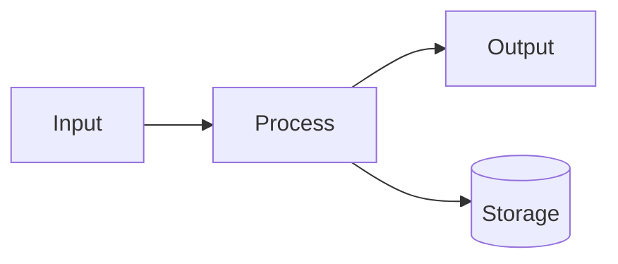

<objective>
Replace the placeholder emit functions from Plan 01 with concrete heredoc template bodies — pinned `requirements-docs.txt` (versions RESOLVED at scaffold-time per Task 0, not hardcoded), full `mkdocs.yml` with Mermaid superfences, sample `docs/architecture.md` with a Mermaid diagram, sample `docs/api.md` with an mkdocstrings `:::` block, and a sample `docs/index.md`. Then run the scaffolded repo through `mkdocs build --strict` against COS-Core (real Pydantic v2 target) to prove DIAG-01 (Mermaid renders) and API-01 (Pydantic v2 native rendering) end-to-end.

Purpose: Prove the scaffolded output is a real, working MkDocs site — not just files on disk.

Output: Updated `scaffold.sh` (single file, all emit functions populated). A successful `mkdocs build --strict` against a temp scaffold of COS-Core, with the built `site/` containing rendered Mermaid SVG and rendered Pydantic field docs (verified by grepping a real field docstring substring).
</objective>

<execution_context>
@$HOME/.claude/get-shit-done/workflows/execute-plan.md
@$HOME/.claude/get-shit-done/templates/summary.md
</execution_context>

<context>
@.planning/PROJECT.md
@.planning/ROADMAP.md
@.planning/STATE.md
@.planning/phases/01-scaffold-template/01-CONTEXT.md
@.planning/phases/01-scaffold-template/01-01-SUMMARY.md

<interfaces>
<!-- Locked CONTEXT.md decisions implemented in this plan -->
- D-12: docs/api.md is generated with auto-detected `::: <package_name>` mkdocstrings block (package_name from Plan 01 detect_python_package, already underscore-normalized per D-13)
- D-14: Default mkdocstrings options block: `show_root_heading: true`, `members_order: alphabetical`
- D-15: Each scaffolded repo gets a standalone `requirements-docs.txt` at its root
- D-16 (interpretation): D-16 specifies WHICH four packages must be pinned with `==`. The literal version `mkdocs-material==1.6.1` in CONTEXT.md is suspect — current mkdocs-material is in the 9.x series; 1.6.x is mkdocs core, not mkdocs-material. Treat D-16 as **"these four packages must be pinned with `==`"** and resolve the actual versions at scaffold-time from PyPI's latest stable (Task 0 below). The four packages:
    * mkdocs-material
    * mkdocs-monorepo-plugin
    * mkdocstrings[python]
    * griffe-pydantic
  Per the `<context_fidelity>` self-check: "Using PyPI-resolved latest stable versions per Task 0 (CONTEXT.md D-16 listed `mkdocs-material==1.6.1` which appears to conflate mkdocs-material with mkdocs core; resolved versions surfaced in completion summary for developer review)."
- D-17: mkdocs.yml markdown_extensions MUST include pymdownx.superfences with the Mermaid custom_fence block

<!-- Reference target for smoke test -->
- /home/btc/github/COS-Core/pyproject.toml — Python repo with [project].name = "cos-core" (declared name; importable module is `cos_core` after D-13 normalization)
- /home/btc/github/COS-Core/src/cos_core/models/ — Pydantic v2 models for mkdocstrings to render
- /home/btc/github/COS-Core/src/cos_core/models/market.py — known to contain trailing-string field docstrings (e.g. `"""Lowercase exchange name: 'coinbase', 'kraken', 'bitstamp'."""`) — this is the API-01 grep target

<!-- pymdownx.superfences Mermaid custom_fence block (verbatim from Material docs / Spike 003 finding) -->
markdown_extensions:
  - pymdownx.superfences:
      custom_fences:
        - name: mermaid
          class: mermaid
          format: !!python/name:pymdownx.superfences.fence_code_format
</interfaces>
</context>

<tasks>

<task type="auto">
  <name>Task 0: Resolve D-16 pin versions at scaffold-time from PyPI</name>
  <files>cos-docs/scripts/scaffold.sh (rewrites emit_requirements_docs_txt heredoc body with resolved versions)</files>
  <read_first>
    - cos-docs/scripts/scaffold.sh (current Plan 01 placeholder for emit_requirements_docs_txt)
    - .planning/phases/01-scaffold-template/01-CONTEXT.md (D-16 verbatim — note the suspect `mkdocs-material==1.6.1` literal)
  </read_first>
  <action>
**Why this task exists:** CONTEXT.md D-16 lists `mkdocs-material==1.6.1` as a literal pin, but mkdocs-material is in the 9.x series (1.6.x is mkdocs core, a different package). The spike-output that produced this pin almost certainly conflated the two. Per `<context_fidelity>`, we honor the user's intent (pin these four packages with `==`) while flagging the literal mismatch. The fix: resolve actual latest-stable versions from PyPI at scaffold-time.

**Steps:**

1. **Resolve latest stable versions from PyPI** for the four D-16 packages. Use one of these approaches (executor's choice — both are equivalent):

   **Option A — `pip index versions` (simpler):**
   ```bash
   for pkg in mkdocs-material mkdocs-monorepo-plugin mkdocstrings griffe-pydantic; do
     # Latest non-pre-release version. pip index lists newest first.
     ver=$(pip index versions "$pkg" 2>/dev/null | grep -oE 'Available versions: [^,]+' | head -1 | sed 's/Available versions: //')
     echo "$pkg==$ver"
   done
   ```

   **Option B — `pip install --dry-run` against a temp venv (more authoritative):**
   ```bash
   TMPVENV=$(mktemp -d)
   python3 -m venv "$TMPVENV/venv"
   "$TMPVENV/venv/bin/pip" install --dry-run --quiet --report - \
     mkdocs-material mkdocs-monorepo-plugin 'mkdocstrings[python]' griffe-pydantic \
     2>/dev/null | python3 -c 'import json,sys; r=json.load(sys.stdin); [print(f"{p[\"metadata\"][\"name\"]}=={p[\"metadata\"][\"version\"]}") for p in r["install"]]'
   rm -rf "$TMPVENV"
   ```

   Capture the four resolved versions into shell variables:
   ```bash
   MKDOCS_MATERIAL_VER="<resolved>"
   MKDOCS_MONOREPO_VER="<resolved>"
   MKDOCSTRINGS_VER="<resolved>"
   GRIFFE_PYDANTIC_VER="<resolved>"
   ```

2. **Sanity check the resolutions:**
   - `mkdocs-material` MUST be `>= 9.0` (anything in 1.x or 2.x indicates wrong package resolved). If the resolved version starts with `1.` or `2.`, HALT with an error message: `"FATAL: mkdocs-material resolved to $MKDOCS_MATERIAL_VER which looks like mkdocs core, not the Material theme. Aborting."`.
   - All four resolutions must be non-empty. If any is empty, HALT: `"FATAL: could not resolve <pkg> version from PyPI. Check network/proxy."`.

3. **Rewrite the `emit_requirements_docs_txt` body in `scaffold.sh`** to embed the resolved versions. Use the Edit tool to replace the placeholder body. The new body MUST be a quoted heredoc with the four lines literally (NOT shell-interpolated at runtime — bake the versions in at this Task 0 step):
   ```bash
   emit_requirements_docs_txt() {
       cat <<'REQS_EOF'
   mkdocs-material==<MKDOCS_MATERIAL_VER>
   mkdocs-monorepo-plugin==<MKDOCS_MONOREPO_VER>
   mkdocstrings[python]==<MKDOCSTRINGS_VER>
   griffe-pydantic==<GRIFFE_PYDANTIC_VER>
   REQS_EOF
   }
   ```
   (Substitute the actual resolved values into those four lines before writing. The `<...>` placeholders MUST NOT remain in the final scaffold.sh.)

4. **Record the resolutions for the completion summary** so the developer-facing note in the SUMMARY can flag the D-16 mismatch:
   ```bash
   echo "Resolved D-16 pins:"
   echo "  mkdocs-material: $MKDOCS_MATERIAL_VER (CONTEXT.md D-16 listed 1.6.1, which appears to conflate with mkdocs core)"
   echo "  mkdocs-monorepo-plugin: $MKDOCS_MONOREPO_VER"
   echo "  mkdocstrings[python]: $MKDOCSTRINGS_VER"
   echo "  griffe-pydantic: $GRIFFE_PYDANTIC_VER"
   ```
   Save this output to `/tmp/d16-resolution.txt` for inclusion in 01-02-SUMMARY.md.
  </action>
  <verify>
    <automated>grep -E '^mkdocs-material==[0-9]+\.[0-9]+' /home/btc/github/cos-docs/scripts/scaffold.sh && grep -E '^mkdocs-monorepo-plugin==' /home/btc/github/cos-docs/scripts/scaffold.sh && grep -E '^mkdocstrings\[python\]==' /home/btc/github/cos-docs/scripts/scaffold.sh && grep -E '^griffe-pydantic==' /home/btc/github/cos-docs/scripts/scaffold.sh && ! grep -E '^mkdocs-material==1\.' /home/btc/github/cos-docs/scripts/scaffold.sh && ! grep -E '<MKDOCS_MATERIAL_VER>|<MKDOCS_MONOREPO_VER>|<MKDOCSTRINGS_VER>|<GRIFFE_PYDANTIC_VER>' /home/btc/github/cos-docs/scripts/scaffold.sh</automated>
  </verify>
  <acceptance_criteria>
    - All four D-16 packages appear with `==<version>` pins in scaffold.sh's emit_requirements_docs_txt body
    - `mkdocs-material` pin is >= 9.0 (NOT 1.x — that would indicate the wrong package was resolved)
    - No `<...>` placeholder strings remain in the heredoc body
    - `/tmp/d16-resolution.txt` captures the four resolved versions for the SUMMARY
  </acceptance_criteria>
  <done>
    D-16 is interpreted as "pin these four packages" (not "pin to these literal versions"); actual versions are resolved at scaffold-time from PyPI; mkdocs-material is in the 9.x series (correct package, not mkdocs core); resolutions are captured for developer-facing note in SUMMARY.
  </done>
</task>

<task type="auto">
  <name>Task 1: Populate remaining emit functions with concrete template bodies (heredocs)</name>
  <files>cos-docs/scripts/scaffold.sh</files>
  <read_first>
    - cos-docs/scripts/scaffold.sh (the skeleton from Plan 01 + emit_requirements_docs_txt from Task 0 — read entirely; locate each remaining placeholder)
    - .planning/phases/01-scaffold-template/01-CONTEXT.md (D-12, D-14, D-15, D-17 verbatim)
  </read_first>
  <action>
Edit `cos-docs/scripts/scaffold.sh` and replace the body of each remaining placeholder emit function (emit_index_md, emit_architecture_md, emit_api_md, emit_mkdocs_yml — emit_requirements_docs_txt is already done in Task 0) with concrete heredoc-emitted content.

**Heredoc terminator convention (read carefully — addresses past contradiction):**
- Use **single-quoted** heredocs (`<<'EOF'`) when the body contains NO shell variables to expand. Single-quoted heredocs do NOT interpret `$`, backticks, or backslashes — so backticks inside Mermaid fences need NO escaping.
- Use **unquoted** heredocs (`<<EOF`) when you need `${1}` or `${SITE_NAME}` to expand.
- Where the body contains both literal backticks (e.g. ` ``` `) and a need to interpolate, prefer single-quoted heredoc + a sentinel terminator string that cannot collide with body content.
- For each function below, the EXACT terminator to use is specified — pick that one and use it consistently as both the opening and closing line.

### emit_mkdocs_yml()

Accepts `$1` = site_name, `$2` = REPO_TYPE. Per D-17 (Mermaid custom_fence) and SCAF-02. Use unquoted heredoc with terminator `MKDOCS_EOF` (interpolation enabled so `${1}` expands). The function must conditionally emit the API nav line only when `${2} == python` (per D-11):

```bash
emit_mkdocs_yml() {
    local site_name="$1"
    local repo_type="$2"
    cat <<MKDOCS_EOF
site_name: ${site_name}

theme:
  name: material
  features:
    - navigation.instant
    - navigation.tracking
    - content.code.copy
    - search.suggest

nav:
  - Overview: index.md
  - Architecture: architecture.md
MKDOCS_EOF
    if [ "$repo_type" = "python" ]; then
        echo "  - API: api.md"
    fi
    cat <<'MKDOCS_PLUGINS_EOF'

plugins:
  - search
  - mkdocstrings:
      handlers:
        python:
          options:
            show_root_heading: true
            members_order: alphabetical

markdown_extensions:
  - admonition
  - pymdownx.details
  - pymdownx.superfences:
      custom_fences:
        - name: mermaid
          class: mermaid
          format: !!python/name:pymdownx.superfences.fence_code_format
MKDOCS_PLUGINS_EOF
}
```

CRITICAL details:
- The `format: !!python/name:...` line MUST appear verbatim — this is the YAML tag that wires Mermaid blocks through superfences. Spike 003 validated this exact form.
- The single-quoted `MKDOCS_PLUGINS_EOF` block prevents the `!!python/name:` from being interpreted as a shell history expansion.

**Update the main() call site** (CRITICAL — addresses past gap):
```bash
write_scaffold_owned mkdocs.yml "emit_mkdocs_yml $SITE_NAME $REPO_TYPE"
```
Both `$SITE_NAME` and `$REPO_TYPE` must be passed. Verify with grep that the call site has both args.

### emit_index_md()

Per SCAF-01. Use single-quoted heredoc with terminator `INDEX_EOF` (no interpolation needed):

```bash
emit_index_md() {
    cat <<'INDEX_EOF'
# Overview

> Replace this with a one-paragraph summary of this repo: purpose, language/runtime, primary entry points.

This page is generated by `cos-docs/scripts/scaffold.sh` and is **user-owned** — re-running the scaffold will not overwrite this file unless you pass `--force`.

## Quick links

- [Architecture](architecture.md)
- [API](api.md)
INDEX_EOF
}
```

### emit_architecture_md()

Per SCAF-01, DIAG-01. The body contains a literal triple-backtick `mermaid` fence — single-quoted heredocs do NOT require any escaping of backticks (they are literal characters in single-quoted heredocs). Use single-quoted heredoc with terminator `ARCHITECTURE_EOF` (sentinel chosen to be guaranteed-absent from the body):

```bash
emit_architecture_md() {
    cat <<'ARCHITECTURE_EOF'
# Architecture

> Replace this with a written overview of this repo's internal structure.

## Sample data flow diagram

The diagram below is rendered by `pymdownx.superfences` + Material's bundled `mermaid.min.js`.
Replace it with a real diagram of this repo's components.


ARCHITECTURE_EOF
}
```

The closing `ARCHITECTURE_EOF` line MUST appear in column 0 (no leading whitespace) — bash heredoc terminators must not be indented unless `<<-` is used (which strips tabs only). Use the unindented form shown.

### emit_api_md()

Accepts `$1` = python package name (already underscore-normalized by Plan 01's `detect_python_package`, e.g. `cos_core`, `cos_docs`). Per D-12, D-14, API-01. Use unquoted heredoc with terminator `API_EOF` (interpolation enabled):

```bash
emit_api_md() {
    local pkg="$1"
    cat <<API_EOF
# API

This page is generated from in-code docstrings by [mkdocstrings](https://mkdocstrings.github.io/python/).
Pydantic v2 models with trailing-string field docstrings render natively via \`griffe-pydantic\`.

::: ${pkg}
    options:
      show_root_heading: true
      members_order: alphabetical
API_EOF
}
```

CRITICAL:
- The `::: ${pkg}` line is the mkdocstrings autodoc directive — column 0, exactly three colons, space, package name.
- Backticks around `griffe-pydantic` ARE escaped (`\``) here because we're in an unquoted heredoc — backticks would otherwise trigger command substitution.
- `${pkg}` is the value returned by `detect_python_package()` — already underscore-normalized per D-13 (so `cos-core` arrived here as `cos_core`).

### Final check after edits

- All five emit_* functions have non-placeholder bodies (no `TODO:` strings remaining)
- `bash -n scaffold.sh` still passes
- File is still executable
- `grep -E 'emit_mkdocs_yml.*\$SITE_NAME.*\$REPO_TYPE' scaffold.sh` returns the main() call site (both args passed)
  </action>
  <verify>
    <automated>bash -n /home/btc/github/cos-docs/scripts/scaffold.sh && ! grep -q 'TODO:' /home/btc/github/cos-docs/scripts/scaffold.sh && grep -q 'pymdownx.superfences' /home/btc/github/cos-docs/scripts/scaffold.sh && grep -q 'custom_fences' /home/btc/github/cos-docs/scripts/scaffold.sh && grep -q 'name: mermaid' /home/btc/github/cos-docs/scripts/scaffold.sh && grep -q 'show_root_heading: true' /home/btc/github/cos-docs/scripts/scaffold.sh && grep -q 'members_order: alphabetical' /home/btc/github/cos-docs/scripts/scaffold.sh && grep -qE 'emit_mkdocs_yml.*\$SITE_NAME.*\$REPO_TYPE' /home/btc/github/cos-docs/scripts/scaffold.sh && grep -q 'ARCHITECTURE_EOF' /home/btc/github/cos-docs/scripts/scaffold.sh</automated>
  </verify>
  <acceptance_criteria>
    - `pymdownx.superfences`, `custom_fences`, `name: mermaid` all appear (D-17)
    - `show_root_heading: true` and `members_order: alphabetical` appear (D-14)
    - `:::` mkdocstrings directive appears in the api.md heredoc (D-12)
    - `ARCHITECTURE_EOF` terminator appears (verifying single-quoted heredoc with the chosen sentinel — no contradiction with EOF)
    - main() call site invokes `emit_mkdocs_yml $SITE_NAME $REPO_TYPE` (BOTH args; verified by grep)
    - No `TODO:` placeholder strings remain
    - `bash -n scaffold.sh` passes
    - Re-running scaffold.sh against a tempdir with COS-Core's pyproject.toml produces a `docs/api.md` containing **EXACTLY** `::: cos_core` (underscore form per D-13). Verify: `grep -q '^::: cos_core$' "$TMPDIR/docs/api.md"`. The hyphenated form `::: cos-core` MUST NOT appear.
  </acceptance_criteria>
  <done>
    scaffold.sh emit functions produce the exact, Mermaid-aware, mkdocstrings-aware template bodies specified in D-12, D-14, D-15, D-17. Single heredoc terminator chosen per function (no contradiction). Main() call site updated to pass REPO_TYPE. No placeholders remain.
  </done>
</task>

<task type="auto">
  <name>Task 2: End-to-end smoke test — scaffold COS-Core in a tempdir, run mkdocs build --strict, verify Mermaid SVG and Pydantic field docs render</name>
  <files>cos-docs/scripts/scaffold.sh (no edits — verification only)</files>
  <read_first>
    - cos-docs/scripts/scaffold.sh (final version)
    - /home/btc/github/COS-Core/pyproject.toml (real-world Python target)
    - /home/btc/github/COS-Core/src/cos_core/models/market.py (source of the API-01 field-docstring substring used in step 7)
  </read_first>
  <action>
End-to-end smoke test against COS-Core (the canonical Pydantic v2 target identified in CONTEXT.md `<specifics>` section). This proves DIAG-01 (Mermaid renders) and API-01 (Pydantic v2 trailing-string field docstrings render natively) end-to-end.

Steps:

1. **Create a working copy of COS-Core in a tempdir** (do NOT modify the real COS-Core repo):
   ```bash
   SMOKE=$(mktemp -d /tmp/scaffold-smoke-cos-core-XXXX)
   cp /home/btc/github/COS-Core/pyproject.toml "$SMOKE/"
   cp -r /home/btc/github/COS-Core/src "$SMOKE/"
   cd "$SMOKE"
   ```

2. **Run scaffold.sh against the tempdir**:
   ```bash
   /home/btc/github/cos-docs/scripts/scaffold.sh "$SMOKE"
   ```
   Verify the five expected files exist (docs/index.md, docs/architecture.md, docs/api.md, mkdocs.yml, requirements-docs.txt).

3. **Verify api.md references the actual COS-Core package — underscore form ONLY**:
   ```bash
   grep -q '^::: cos_core$' "$SMOKE/docs/api.md" || { echo "FAIL: api.md missing '::: cos_core' (D-13 normalization broken)"; exit 1; }
   ! grep -q '^::: cos-core$' "$SMOKE/docs/api.md" || { echo "FAIL: api.md contains hyphenated '::: cos-core' (D-13 normalization not wired)"; exit 1; }
   ```

4. **Create a venv and install the pinned requirements** (per D-15):
   ```bash
   python3 -m venv "$SMOKE/.venv"
   source "$SMOKE/.venv/bin/activate"
   pip install -r "$SMOKE/requirements-docs.txt"
   pip install -e "$SMOKE"
   ```

   IF any pin fails to install, HALT and emit:
   ```
   PINNED VERSION INSTALL FAILURE: <package>==<version>
   Note: Task 0 resolved versions from PyPI. If a resolved version is unavailable, re-run Task 0 with --pre disallowed and capture the next-most-recent stable.
   ```

5. **Run mkdocs build --strict from the tempdir**:
   ```bash
   cd "$SMOKE"
   mkdocs build --strict 2>&1 | tee /tmp/mkdocs-build.log
   ```
   Expect exit 0 with no warnings.

6. **Verify Mermaid renders (DIAG-01)** — locate the architecture page in the built site (path varies by mkdocs config — could be `architecture/index.html` for directory_urls=true or `architecture.html` for false):
   ```bash
   ARCH_HTML=$(find "$SMOKE/site" -path '*architecture*' -name '*.html' | head -1)
   [ -n "$ARCH_HTML" ] || { echo "FAIL: architecture page not built"; exit 1; }
   grep -q 'class="mermaid"' "$ARCH_HTML" \
     || { echo "FAIL: Mermaid block not present in built site at $ARCH_HTML"; exit 1; }
   ```

7. **Verify Pydantic v2 field docs render (API-01) — by grepping for an actual FIELD DOCSTRING substring (NOT a class name)**:

   Class names render even without griffe-pydantic, so grepping for `OHLCVBar` only proves the class was imported, not that field-level docstrings rendered. To prove API-01, grep for a known trailing-string field docstring substring from a COS-Core Pydantic v2 model.

   Use this exact substring from `/home/btc/github/COS-Core/src/cos_core/models/market.py` line 16 (verified to be a trailing-string field docstring on the `exchange` field of `OHLCVBar`): `Lowercase exchange name`

   ```bash
   API_HTML=$(find "$SMOKE/site" -path '*api*' -name '*.html' | head -1)
   [ -n "$API_HTML" ] || { echo "FAIL: api page not built"; exit 1; }
   grep -q 'Lowercase exchange name' "$API_HTML" \
     || { echo "FAIL: API-01 not satisfied — Pydantic v2 trailing-string field docstring 'Lowercase exchange name' (from OHLCVBar.exchange in COS-Core/src/cos_core/models/market.py) did not render in built api page at $API_HTML. This proves griffe-pydantic is NOT actually rendering Pydantic field docs."; exit 1; }
   ```

   (Fallback: if for any reason `market.py` no longer contains that exact substring at execute-time, the executor should open `/home/btc/github/COS-Core/src/cos_core/models/*.py`, identify any 3-6-word substring inside a trailing-string Pydantic field docstring (the `"""..."""` lines that follow a typed field declaration), and substitute that substring above. The verification's purpose — proving field-doc rendering, not class-name presence — must be preserved.)

8. **Cleanup**:
   ```bash
   deactivate || true
   rm -rf "$SMOKE"
   ```

If ALL steps pass, print `E2E SMOKE OK — DIAG-01 + API-01 + SCAF-02 + SCAF-03 verified end-to-end against COS-Core`.

Document the build log location and any warnings (even non-fatal) in the task summary.
  </action>
  <verify>
    <automated>bash -c 'set -e; SMOKE=$(mktemp -d); cp /home/btc/github/COS-Core/pyproject.toml "$SMOKE/"; cp -r /home/btc/github/COS-Core/src "$SMOKE/"; /home/btc/github/cos-docs/scripts/scaffold.sh "$SMOKE" >/dev/null 2>&1; test -f "$SMOKE/docs/api.md" && test -f "$SMOKE/mkdocs.yml" && test -f "$SMOKE/requirements-docs.txt"; grep -q "^::: cos_core$" "$SMOKE/docs/api.md"; ! grep -q "^::: cos-core$" "$SMOKE/docs/api.md"; grep -q "pymdownx.superfences" "$SMOKE/mkdocs.yml"; grep -q "name: mermaid" "$SMOKE/mkdocs.yml"; rm -rf "$SMOKE"; echo TEMPLATE_OK'</automated>
  </verify>
  <acceptance_criteria>
    - scaffold.sh runs cleanly against a COS-Core tempdir copy
    - Generated docs/api.md contains EXACTLY `::: cos_core` (underscore form) and does NOT contain `::: cos-core`
    - Generated mkdocs.yml contains `pymdownx.superfences` and `name: mermaid` (verifying D-17)
    - Generated requirements-docs.txt contains all four D-16 packages with `==<version>` pins (versions resolved at Task 0)
    - `pip install -r requirements-docs.txt` succeeds in a fresh venv
    - `mkdocs build --strict` exits 0 with no warnings
    - Built `site/` contains a `class="mermaid"` element on the architecture page (DIAG-01)
    - Built `site/` contains the literal substring `Lowercase exchange name` on the api page (API-01 — proves griffe-pydantic rendered the trailing-string field docstring of `OHLCVBar.exchange`, NOT just the class name)
  </acceptance_criteria>
  <done>
    Phase 1 end-to-end proof complete: a fresh scaffold of a real Python repo with Pydantic v2 models builds a working Material site with Mermaid AND Pydantic FIELD-LEVEL docstring rendering (not just class names). SCAF-02, SCAF-03, DIAG-01, API-01 are demonstrated end-to-end against COS-Core.
  </done>
</task>

</tasks>

<verification>
- D-16 pin versions resolved at scaffold-time (Task 0); mkdocs-material is in 9.x series, not 1.x
- All five emit_* functions in scaffold.sh have concrete bodies (no `TODO:` strings)
- D-17 Mermaid custom_fence block literally present in scaffold.sh source
- D-14 mkdocstrings options literally present in scaffold.sh source
- D-12 `:::` directive literally present in scaffold.sh source
- main() call site passes both `$SITE_NAME` and `$REPO_TYPE` to `emit_mkdocs_yml`
- Heredoc terminators are consistent within each function (single chosen per function: REQS_EOF, MKDOCS_EOF/MKDOCS_PLUGINS_EOF, INDEX_EOF, ARCHITECTURE_EOF, API_EOF)
- End-to-end: COS-Core tempdir scaffolded → `pip install -r requirements-docs.txt` → `mkdocs build --strict` succeeds
- Built site contains Mermaid SVG container + Pydantic FIELD docstring substring (`Lowercase exchange name`), proving griffe-pydantic actually renders fields
</verification>

<success_criteria>
Plan 02 is complete when:
- [ ] Task 0 resolved D-16 pin versions from PyPI; mkdocs-material is in the 9.x series
- [ ] scaffold.sh emit_* functions produce concrete, pinned, Mermaid-aware, mkdocstrings-aware templates
- [ ] All locked decisions D-12, D-14, D-15, D-16 (per Task 0 interpretation), D-17 implemented
- [ ] main() call site updated to pass REPO_TYPE to emit_mkdocs_yml
- [ ] End-to-end smoke against COS-Core: `mkdocs build --strict` exits 0
- [ ] Built site demonstrates DIAG-01 (Mermaid) and API-01 (Pydantic FIELD-level rendering, verified by field-docstring substring grep, not class-name grep)
- [ ] Phase 1 ROADMAP success criteria 1-5 all verifiable from this plan's output
</success_criteria>

<output>
After completion, create `.planning/phases/01-scaffold-template/01-02-SUMMARY.md` summarizing:
- Edits made to scaffold.sh (which emit_* functions populated, main() call site update)
- D-12, D-14, D-15, D-17 mapped to specific lines in scaffold.sh
- **D-16 resolution note (developer-facing)**: Include contents of `/tmp/d16-resolution.txt` verbatim. Flag explicitly: "CONTEXT.md D-16 listed `mkdocs-material==1.6.1` which appears to conflate mkdocs-material (currently 9.x) with mkdocs core (currently 1.6.x). Resolved versions from PyPI at scaffold-time. Recommend updating CONTEXT.md D-16 to either remove literal versions (treat as 'pin these four packages') or update to current 9.x/etc."
- E2E smoke-test results: Task 0 resolutions, pip install outcome, mkdocs build outcome, Mermaid grep result, Pydantic FIELD-docstring grep result (substring used + path it was found at)
- Confirmation that all 5 ROADMAP §"Phase 1" success criteria are now demonstrable
</output>
</content>
