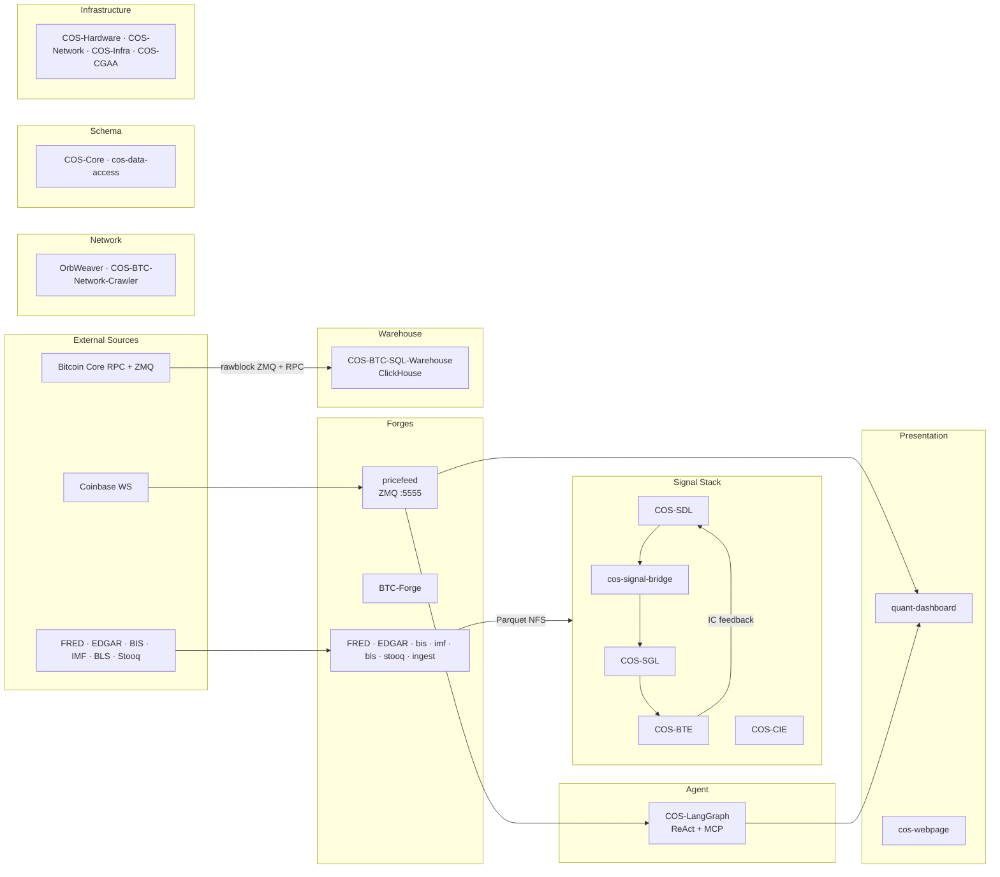

<objective>
Author the top-level `cos-docs/docs/index.md` (full repo-index table + quick-start + 8-domain blurbs) and `cos-docs/docs/architecture.md` (workspace-wide Mermaid data-flow diagram + narrative), wire the architecture page into the aggregator nav, and run the final end-to-end strict-build gate: `build-all-api.sh --keep && mkdocs build --strict && build-all-api.sh --restore`.

Purpose: Closes AGGR-03 (top-level index + architecture pages) and DIAG-03 (workspace data-flow diagram). This is the phase-closing plan — after it ships, all 8 Phase 3 requirements (AGGR-01..05, DIAG-03, API-02, API-03) are satisfied.

Output:
- `cos-docs/docs/index.md` (full — replaces 03-01 placeholder)
- `cos-docs/docs/architecture.md` (new)
- `cos-docs/mkdocs.yml` (adds 1 nav line)
- Final end-to-end strict build green; Mermaid renders as SVG in `site/architecture/index.html`.
</objective>

<execution_context>
@$HOME/.claude/get-shit-done/workflows/execute-plan.md
@$HOME/.claude/get-shit-done/templates/summary.md
</execution_context>

<context>
@.planning/PROJECT.md
@.planning/ROADMAP.md
@.planning/STATE.md
@.planning/phases/03-aggregator-api-strategy/03-CONTEXT.md
@.planning/phases/03-aggregator-api-strategy/03-RESEARCH.md
@.planning/phases/03-aggregator-api-strategy/03-PATTERNS.md
@/home/btc/github/CLAUDE.md

<interfaces>
# Analog donor for H1 + "## Overview" + "## Diagram" structure:
# /home/btc/github/COS-Core/docs/architecture.md
#   # Architecture
#   ## Overview
#   <prose>
#   ## Diagram
#   ```mermaid
#   graph TD
#     <nodes + edges>
#   ```

# Analog donor for H1 + prose + fenced code block:
# /home/btc/github/COS-Core/docs/index.md
#   # COS-Core
#   ## Purpose
#   **COS-Core** is ...
#   ## Usage
#   ```python
#   from cos_core... import ...
#   ```

# Fenced block that already works in Material (Spike 003 validated + Phase 1 E2E smoke):
# (enabled via pymdownx.superfences custom_fences in cos-docs/mkdocs.yml from Plan 03-01)
#   ```mermaid
#   flowchart LR
#       A --> B
#   ```
# Renders as SVG in the browser; no extra plugin required (Material bundles mermaid.min.js).

# Source of truth for repo-index-table rows:
# /home/btc/github/CLAUDE.md §"Project Map" — 26-repo table with language + purpose.
# Filter: the 29 in-scope repos from Plan 03-01, grouped into the 8 domains per D-07/D-08.

# D-13 Mermaid constraints:
# - 8 domain nodes (one per left-nav header)
# - 5-6 critical data arrows (the workspace-scale flows)
# - Fits on a single screen (LR orientation recommended)
# - Hand-authored (D-14)
</interfaces>
</context>

<tasks>

<task type="auto">
  <name>Task 1: Author cos-docs/docs/architecture.md (workspace Mermaid + narrative)</name>
  <files>cos-docs/docs/architecture.md</files>
  <read_first>
    - /home/btc/github/COS-Core/docs/architecture.md (H1 + "## Overview" + "## Diagram" analog)
    - /home/btc/github/cos-docs/.planning/phases/03-aggregator-api-strategy/03-RESEARCH.md §"Code Examples" — `cos-docs/docs/architecture.md` skeleton (starting draft; lines 494-556 of 03-RESEARCH.md)
    - /home/btc/github/cos-docs/.planning/phases/03-aggregator-api-strategy/03-CONTEXT.md §"D-12", §"D-13", §"D-14", §"D-15"
    - /home/btc/github/CLAUDE.md §"Architecture" — canonical workspace-wide data flows (Real-Time Data Pipeline, Pattern Overview, Bounded Domains)
    - /home/btc/github/cos-docs/mkdocs.yml (from Plan 03-01 — confirms pymdownx.superfences custom_fences is enabled)
  </read_first>
  <action>
Write `/home/btc/github/cos-docs/docs/architecture.md` atomically with EXACTLY this content. The Mermaid diagram is hand-authored per D-14; it captures 8 domain subgraphs + the critical workspace data flows per D-13. Each subgraph labels match the 8 nav groups from Plan 03-01.

```markdown
# Workspace Architecture

## Overview

The COS / Xuer Capital stack is an 8-domain quantitative-finance platform
spanning data ingestion, signal composition, backtesting, on-chain analytics,
agent reasoning, and live-trading presentation. Each repo is an independent
git repo under `/home/btc/github/`; the aggregator composes their `docs/` via
[mkdocs-monorepo-plugin](https://backstage.github.io/mkdocs-monorepo-plugin/).

The data plane is anchored on three real-time sources (Coinbase WS for prices,
Bitcoin Core ZMQ for on-chain blocks, and batch Parquet pulls for macro/financial
data) and flows through the Signal Stack (SDL discovers factors, SGL computes
them, CIE composes indicators, BTE backtests them) into the Presentation layer
(Bloomberg-style React dashboard). The Agent layer (LangGraph) reasons over both
real-time prices and on-chain query APIs. Infrastructure and Schema repos
underpin the whole stack with canonical Pydantic models, K8s deployment specs,
and hardware inventory.

See per-repo architecture pages for internal details — this diagram is the
workspace-scale view only.

## Diagram



## Links to per-repo architecture

Each non-exempt repo's own Mermaid lives in `docs/architecture.md`:

- **Forges:** [BTC-Forge](BTC-Forge/architecture/) · [FRED-Forge](FRED-Forge/architecture/) · [EDGAR-Forge](EDGAR-Forge/architecture/) · [bis-forge](bis-forge/architecture/) · [bls-forge](bls-forge/architecture/) · [imf-forge](imf-forge/architecture/) · [ingest](ingest/architecture/) · [stooq-forge](stooq-forge/architecture/)
- **Signal Stack:** [COS-BTE](COS-BTE/architecture/) · [COS-CIE](COS-CIE/architecture/) · [COS-MSE](COS-MSE/architecture/) · [COS-SGL](COS-SGL/architecture/) · [cos-signal-bridge](cos-signal-bridge/architecture/) · [cos-signal-explorer](cos-signal-explorer/architecture/)
- **Agent:** [COS-Bitcoin-Protocol-Intelligence-Platform](COS-Bitcoin-Protocol-Intelligence-Platform/architecture/) · [COS-LangGraph](COS-LangGraph/architecture/)
- **Presentation:** [cos-webpage](cos-webpage/architecture/) · [quant-dashboard](quant-dashboard/architecture/)
- **Warehouse:** [COS-BTC-Node](COS-BTC-Node/architecture/) · [COS-BTC-SQL-Warehouse](COS-BTC-SQL-Warehouse/architecture/) · [coinbase_websocket_BTC_pricefeed](coinbase_websocket_BTC_pricefeed/architecture/)
- **Network:** [COS-BTC-Network-Crawler](COS-BTC-Network-Crawler/architecture/) · [OrbWeaver](OrbWeaver/architecture/)
- **Schema:** [COS-Core](COS-Core/architecture/) · [cos-data-access](cos-data-access/architecture/)
- **Infrastructure:** (docs-only repos; see individual overviews)
```

Use atomic write (tmp → rename).

Notes for executor:
- The Mermaid fenced block uses `flowchart LR` (landscape) per Claude's discretion (D-14). Fits on a single screen.
- 8 subgraphs = 8 domain nodes per D-13 (EXT is an external-sources context node, not a domain; the 8 domain subgraphs are FRG, WH, SIG, AGT, NET, SCH, PRS, INF).
- Exactly 6 critical workspace data arrows per D-13: (1) Coinbase→pricefeed→quant-dashboard; (2) pricefeed→COS-LangGraph; (3) Bitcoin-Core→COS-BTC-SQL-Warehouse; (4) macro forges→NFS→Signal Stack; (5) SDL→bridge→SGL→BTE→SDL IC feedback loop; (6) COS-LangGraph→quant-dashboard.
- Do NOT add more arrows. If additional flows seem important, raise with user — D-13 is a hard cap.
- Links point to aggregator-relative paths (e.g., `BTC-Forge/architecture/`), NOT absolute (Pitfall 7).
  </action>
  <verify>
    <automated>test -f /home/btc/github/cos-docs/docs/architecture.md && grep -q '^# Workspace Architecture' /home/btc/github/cos-docs/docs/architecture.md && grep -q '^```mermaid' /home/btc/github/cos-docs/docs/architecture.md && [ "$(grep -c '^    subgraph ' /home/btc/github/cos-docs/docs/architecture.md)" -ge 8 ] && ARROWS=$(grep -cE '^    [A-Z].*-(-|\.-)>' /home/btc/github/cos-docs/docs/architecture.md) && [ "$ARROWS" -ge 5 ] && [ "$ARROWS" -le 6 ] && ! grep -qE '\]\(/' /home/btc/github/cos-docs/docs/architecture.md</automated>
  </verify>
  <acceptance_criteria>
    - File exists at `/home/btc/github/cos-docs/docs/architecture.md`
    - Contains H1 `# Workspace Architecture`
    - Contains a fenced ```mermaid``` block
    - Contains exactly 8 domain `subgraph ` labels: FRG, WH, SIG, AGT, NET, SCH, PRS, INF (plus one external-context `EXT` subgraph, total 9 `subgraph ` lines)
    - Contains 5-6 arrow-chain lines (excluding comments / `%%` lines) per D-13 — no more, no fewer
    - Contains "## Overview" and "## Diagram" section headers (analog-matched from COS-Core)
    - Contains "## Links to per-repo architecture" section
    - NO absolute-path links (`](/...)` pattern — Pitfall 7)
  </acceptance_criteria>
  <done>Workspace architecture.md authored; Mermaid block + 8 subgraphs + narrative + per-repo link index present.</done>
</task>

<task type="auto">
  <name>Task 2: Author full cos-docs/docs/index.md (repo index table + quick-start + domain blurbs) + add Architecture to aggregator nav</name>
  <files>cos-docs/docs/index.md, cos-docs/mkdocs.yml</files>
  <read_first>
    - /home/btc/github/COS-Core/docs/index.md (H1 + prose + code-block convention analog)
    - /home/btc/github/CLAUDE.md §"Project Map" (source of truth for repo table rows: name, language, purpose)
    - /home/btc/github/cos-docs/.planning/phases/03-aggregator-api-strategy/03-RESEARCH.md §"Code Examples" — `cos-docs/docs/index.md` skeleton
    - /home/btc/github/cos-docs/.planning/phases/03-aggregator-api-strategy/03-CONTEXT.md §"D-11" (index.md contents contract: repo table + quick-start + one-line domain description)
    - /home/btc/github/cos-docs/mkdocs.yml (existing 03-01 version — know current nav structure before editing)
  </read_first>
  <action>
Part A — Replace `/home/btc/github/cos-docs/docs/index.md` (the 03-01 placeholder) with the full landing page. Atomic write (tmp → rename). Content — use exactly this structure, pulling repo-table rows from `/home/btc/github/CLAUDE.md` §"Project Map":

```markdown
# Xuer Capital Workspace Docs

> Single entry-point to every COS / Xuer Capital repo's architecture, API,
> and diagrams. Built from ~29 sibling repos under `/home/btc/github/`
> via [mkdocs-monorepo-plugin](https://backstage.github.io/mkdocs-monorepo-plugin/).

The workspace is a quantitative-finance platform organized into 8 domains:
data ingestion (Forges), signal composition (Signal Stack), agent reasoning,
real-time presentation, on-chain analytics (Warehouse), network intelligence,
canonical schemas, and deployment/infrastructure. Use the left-nav to browse
by domain, or follow a link from the table below.

## Quick start

```bash
cd /home/btc/github/cos-docs
./scripts/build-all-api.sh --keep       # pre-render per-repo API pages in isolated venvs
mkdocs build --strict                    # aggregator build (zero warnings tolerated)
./scripts/build-all-api.sh --restore    # restore per-repo docs/api.md to declarative form

# Local preview (optional):
mkdocs serve                             # http://127.0.0.1:8000
```

See [Workspace Architecture](architecture.md) for the workspace-wide data-flow diagram.

## Repos by domain

### Forges — external data ingestion into Parquet / NFS

| Repo | Language | Purpose |
|------|----------|---------|
| [bis-forge](bis-forge/) | Python | BIS SDMX downloader |
| [bls-forge](bls-forge/) | Python | BLS downloader |
| [BTC-Forge](BTC-Forge/) | Python | Bitcoin OHLCV downloader (Coinbase/Kraken/Bitstamp) |
| [EDGAR-Forge](EDGAR-Forge/) | Python | SEC EDGAR filings downloader |
| [FRED-Forge](FRED-Forge/) | Python | FRED economic data downloader |
| [imf-forge](imf-forge/) | Python | IMF SDMX downloader |
| [ingest](ingest/) | Python | Shared ingestion primitives (reference connector) |
| [stooq-forge](stooq-forge/) | Python | Stooq market data downloader |

### Signal Stack — factor algebra, signal computation, composition, backtesting

| Repo | Language | Purpose |
|------|----------|---------|
| [COS-BTE](COS-BTE/) | Python | Backtesting engine (NautilusTrader) |
| [COS-CIE](COS-CIE/) | Python | Composite Indicator Engine — scoring + composition |
| [COS-MSE](COS-MSE/) | Python | Market Sentiment Engine — volatility regime research |
| [COS-SGL](COS-SGL/) | Python | Signal Generation Layer — multi-frequency signal mixing |
| [cos-signal-bridge](cos-signal-bridge/) | Python | SDL→SGL→BTE pipeline glue + IC feedback |
| [cos-signal-explorer](cos-signal-explorer/) | Python | Marimo research app for SDL factor authoring |

### Agent — LLM reasoning over workspace data

| Repo | Language | Purpose |
|------|----------|---------|
| [COS-Bitcoin-Protocol-Intelligence-Platform](COS-Bitcoin-Protocol-Intelligence-Platform/) | Python | BIP lifecycle tracking → investment intelligence |
| [COS-LangGraph](COS-LangGraph/) | Python | ReAct LLM agent (FastAPI, K8s NodePort 30091) |

### Presentation — live trading UI + institutional landing page

| Repo | Language | Purpose |
|------|----------|---------|
| [cos-webpage](cos-webpage/) | TS (Next.js) | Xuer Capital institutional landing page |
| [quant-dashboard](quant-dashboard/) | TS / React | Bloomberg-style trading dashboard |

### Warehouse — on-chain ETL + full-node deploy

| Repo | Language | Purpose |
|------|----------|---------|
| [coinbase_websocket_BTC_pricefeed](coinbase_websocket_BTC_pricefeed/) | Python | ZMQ price publisher (Coinbase WS → PUB:5555) |
| [COS-BTC-Node](COS-BTC-Node/) | Config / Docker | Bitcoin Core v27.2 full-node deploy |
| [COS-BTC-SQL-Warehouse](COS-BTC-SQL-Warehouse/) | Python | Bitcoin full-chain ETL → ClickHouse |

### Network — Bitcoin P2P peer topology

| Repo | Language | Purpose |
|------|----------|---------|
| [COS-BTC-Network-Crawler](COS-BTC-Network-Crawler/) | Python | Bitcoin peer topology (PostgreSQL + Neo4j) |
| [OrbWeaver](OrbWeaver/) | Python | Bitcoin network crawler |

### Schema — canonical Pydantic models + typed query layer

| Repo | Language | Purpose |
|------|----------|---------|
| [COS-Core](COS-Core/) | Python | Canonical Pydantic v2 schemas + forge adapters |
| [cos-data-access](cos-data-access/) | Python | Typed, cacheable query layer over catalog sources |

### Infrastructure — hardware, network, deploy specs

| Repo | Language | Purpose |
|------|----------|---------|
| [COS-Capability-Gated-Agent-Architecture](COS-Capability-Gated-Agent-Architecture/) | Spec | Zero-trust autonomous agent formal spec |
| [COS-Hardware](COS-Hardware/) | Docs | Server hardware specs and host inventory |
| [COS-Infra](COS-Infra/) | Docs / Config | Workspace deployment guides and K8s automation |
| [COS-Network](COS-Network/) | Docs / Config | Physical / VLAN / routing / firewall / services |

## Excluded from aggregation

- **COS-electrs** (Rust / Cargo-only — does not fit the MkDocs + Python pipeline)
- **capability-gated-agent-architecture** (lowercase duplicate; PascalCase version is canonical)
- **quant-dashboard-k8s-deployment** (mentioned in workspace CLAUDE.md but not present on disk as of 2026-04-19)
```

Part B — Add the Architecture page to aggregator nav.

Edit `/home/btc/github/cos-docs/mkdocs.yml` to insert `- Architecture: architecture.md` immediately after `- Overview: index.md`. The nav block after edit should open:

```yaml
nav:
  - Overview: index.md
  - Architecture: architecture.md
  - Forges:
      - bis-forge: '!include ../bis-forge/mkdocs.yml'
      ...
```

Atomic write (read → in-memory edit → tmp write → rename).
  </action>
  <verify>
    <automated>test -f /home/btc/github/cos-docs/docs/index.md && grep -q '^# Xuer Capital Workspace Docs' /home/btc/github/cos-docs/docs/index.md && grep -q '^## Quick start' /home/btc/github/cos-docs/docs/index.md && grep -q '^## Repos by domain' /home/btc/github/cos-docs/docs/index.md && [ "$(grep -c '^###' /home/btc/github/cos-docs/docs/index.md)" -ge 8 ] && [ "$(grep -cE '^\| \[' /home/btc/github/cos-docs/docs/index.md)" -ge 25 ] && grep -q '- Architecture: architecture.md' /home/btc/github/cos-docs/mkdocs.yml</automated>
  </verify>
  <acceptance_criteria>
    - `cos-docs/docs/index.md` exists with H1 `# Xuer Capital Workspace Docs`
    - Contains `## Quick start` section with a fenced bash block
    - Contains `## Repos by domain` section
    - Has at least 8 `### ` domain subsections
    - Has at least 25 markdown table rows of the form `| [<repo>](<slug>/) |` (one per in-scope repo, ≤ 29)
    - `cos-docs/mkdocs.yml` contains exactly the line `  - Architecture: architecture.md` between `- Overview: index.md` and `- Forges:`
    - `! grep -qE '\]\(/' /home/btc/github/cos-docs/docs/index.md` (no absolute-path links — Pitfall 7)
  </acceptance_criteria>
  <done>Full index.md authored + aggregator nav wired to include Architecture page.</done>
</task>

<task type="auto">
  <name>Task 3: Final end-to-end strict-build gate — pre-render, aggregator build, Mermaid SVG smoke, restore</name>
  <files>cos-docs/site/ (build output — not committed)</files>
  <read_first>
    - /home/btc/github/cos-docs/scripts/build-all-api.sh (from 03-02)
    - /home/btc/github/cos-docs/mkdocs.yml (after Task 2 — includes Architecture nav line)
    - /home/btc/github/cos-docs/.planning/phases/03-aggregator-api-strategy/03-RESEARCH.md §"Pitfall 6" (site_url), §"Pitfall 7" (absolute links)
  </read_first>
  <action>
Run the final end-to-end gate:

```bash
cd /home/btc/github/cos-docs

# Pitfall 7 grep gate — informational; surface numerous hits to user but do not block.
echo "--- Absolute-link audit (Pitfall 7) ---"
grep -rnE '\]\(/' /home/btc/github/*/docs/*.md 2>/dev/null | grep -v '^Binary' | head -20 || echo "(no hits)"

# Pre-render sweep, keep swap retained for aggregator build
./scripts/build-all-api.sh --keep

# Check status file — every row must be OK
if grep -E '\| FAIL' .build-all-api-status.md; then
    echo "FATAL: build-all-api.sh reported failures; see .build-all-api-status.md"
    ./scripts/build-all-api.sh --restore
    exit 1
fi

# Aggregator strict build
rm -rf .venv-aggr site
uv venv --quiet .venv-aggr
uv pip install --quiet --python .venv-aggr/bin/python -r requirements-docs.txt
.venv-aggr/bin/mkdocs build --strict

# Smoke assertion 1: Architecture page rendered
test -f site/architecture/index.html || { echo FAIL: no architecture page; exit 1; }

# Smoke assertion 2: Mermaid is rendered as a div with class="mermaid" (Material's
# superfences custom_fence emits <pre class="mermaid"> OR <div class="mermaid"> —
# both acceptable; Material's bundled mermaid.min.js scans for class="mermaid"
# on page load and converts the text to SVG client-side).
grep -qE '<(pre|div)[^>]*class="[^"]*mermaid' site/architecture/index.html \
    || { echo FAIL: no mermaid class div in architecture/index.html; exit 1; }

# Smoke assertion 3: workspace diagram text is present (subgraph labels)
grep -q 'subgraph' site/architecture/index.html \
    || { echo FAIL: no subgraph in architecture HTML; exit 1; }

# Smoke assertion 4: every Python repo's API page is populated (from 03-02 E2E check)
MISSING=()
for r in bis-forge bls-forge BTC-Forge COS-Bitcoin-Protocol-Intelligence-Platform \
         COS-BTC-Network-Crawler COS-BTC-SQL-Warehouse COS-BTE COS-CIE COS-Core \
         cos-data-access COS-LangGraph COS-MSE COS-SGL cos-signal-bridge \
         cos-signal-explorer EDGAR-Forge FRED-Forge imf-forge ingest stooq-forge; do
  f=site/$r/api/index.html
  if [ ! -f "$f" ] || ! grep -q 'cos-docs-prerendered-api' "$f"; then
    MISSING+=("$r")
  fi
done
if [ "${#MISSING[@]}" -ne 0 ]; then
  echo "FAIL: API page not populated: ${MISSING[*]}"
  ./scripts/build-all-api.sh --restore
  exit 1
fi

# Smoke assertion 5: no literal `:::` mkdocstrings directives leaked (Pitfall 1)
if grep -l '^:::' site/*/api/index.html 2>/dev/null | head -1 | grep -q .; then
    echo "FAIL: un-rendered mkdocstrings directives leaked"
    ./scripts/build-all-api.sh --restore
    exit 1
fi

# Smoke assertion 6: Repo index page has 8 domain sections + table rows
grep -c '^###' site/index.html  # informational

# Smoke assertion 7: left-nav groups — Material renders nav as <nav class="md-nav">;
# look for each domain label present in site/index.html
for domain in 'Forges' 'Signal Stack' 'Agent' 'Presentation' 'Warehouse' 'Network' 'Schema' 'Infrastructure'; do
    grep -q ">$domain<" site/index.html \
        || { echo "FAIL: domain '$domain' not found in left-nav"; ./scripts/build-all-api.sh --restore; exit 1; }
done

echo "=== ALL SMOKE ASSERTIONS PASSED ==="

# Restore per-repo originals
./scripts/build-all-api.sh --restore

# Teardown aggregator venv + site
rm -rf .venv-aggr site
```

If any assertion fails, the task fails. Do NOT commit until all green.

Additional manual review (non-blocking):
- `mkdocs serve` briefly to eyeball the Mermaid rendering client-side (Material bundles `mermaid.min.js`; the `<div class="mermaid">` is converted to SVG on page load). User confirms visually.
- Check Material's default search works across aggregated content by searching for "OHLCV" or "ClickHouse" — expect multi-repo hits.
  </action>
  <verify>
    <automated>cd /home/btc/github/cos-docs && ./scripts/build-all-api.sh --keep && ! grep -qE '\| FAIL' .build-all-api-status.md && rm -rf .venv-aggr site && uv venv --quiet .venv-aggr && uv pip install --quiet --python .venv-aggr/bin/python -r requirements-docs.txt && .venv-aggr/bin/mkdocs build --strict && test -f site/architecture/index.html && grep -qE '<(pre|div)[^>]*class="[^"]*mermaid' site/architecture/index.html && bash -c 'MISSING=(); for r in bis-forge bls-forge BTC-Forge COS-Bitcoin-Protocol-Intelligence-Platform COS-BTC-Network-Crawler COS-BTC-SQL-Warehouse COS-BTE COS-CIE COS-Core cos-data-access COS-LangGraph COS-MSE COS-SGL cos-signal-bridge cos-signal-explorer EDGAR-Forge FRED-Forge imf-forge ingest stooq-forge; do f=site/$r/api/index.html; { [ -f "$f" ] && grep -q "cos-docs-prerendered-api" "$f"; } || MISSING+=("$r"); done; [ ${#MISSING[@]} -eq 0 ]' && ! bash -c 'grep -l "^:::" site/*/api/index.html 2>/dev/null | head -1 | grep -q .' && ./scripts/build-all-api.sh --restore && rm -rf .venv-aggr site</automated>
  </verify>
  <acceptance_criteria>
    - `build-all-api.sh --keep` exits 0; `.build-all-api-status.md` contains no FAIL rows
    - Aggregator `mkdocs build --strict` exits 0
    - `site/architecture/index.html` exists and contains a `<pre class="mermaid">` or `<div class="mermaid">` element
    - `site/architecture/index.html` contains the string `subgraph` (diagram text)
    - Every Python repo's `site/<repo>/api/index.html` contains `cos-docs-prerendered-api` (20 repos)
    - Zero files in `site/*/api/index.html` contain `^:::` literal directives
    - `site/index.html` contains each of the 8 domain labels: Forges, Signal Stack, Agent, Presentation, Warehouse, Network, Schema, Infrastructure
    - After `--restore`: all per-sibling-repo `docs/api.md` back to declarative `:::` form
    - Cleanup: `site/` and `.venv-aggr/` not left on disk post-run
  </acceptance_criteria>
  <done>Phase 3 end-to-end strict-build green with all smoke assertions passing. AGGR-01..05, DIAG-03, API-02, API-03 all closed.</done>
</task>

</tasks>

<threat_model>
## Trust Boundaries

| Boundary | Description |
|----------|-------------|
| CLAUDE.md content → repo-index table in docs/index.md | Workspace descriptors copied into a public docs page |
| Hand-authored Mermaid source → client-side SVG render | Browser parses Mermaid via Material's bundled `mermaid.min.js` |
| Aggregator build → final site/ output | Single `mkdocs build --strict` produces static HTML only |

## STRIDE Threat Register

| Threat ID | Category | Component | Disposition | Mitigation Plan |
|-----------|----------|-----------|-------------|-----------------|
| T-03-03-01 | Tampering (supply-chain) | Material's bundled `mermaid.min.js` (client-side) | mitigate | Material 9.7.6 pinned in `cos-docs/requirements-docs.txt` (Plan 03-01); version hash locked; client fetches from same origin as aggregator site. No external CDN imports. |
| T-03-03-02 | Injection (Mermaid XSS) | Hand-authored Mermaid source | accept | Mermaid text is author-controlled (D-14 locked: hand-authored, user-reviewed). No user input crosses into the fenced block. Mermaid library sanitizes its own inputs for XSS (CSP-compatible); worst case is a rendering error, not script execution. |
| T-03-03-03 | Information Disclosure | index.md repo-index table exposes internal project structure | accept | Internal network only per PROJECT.md constraints; deliberate audience is the maintainer. No secrets, no credentials, no private URLs beyond `10.70.0.102:30081`. |
| T-03-03-04 | Denial of Service | Mermaid diagram size / parse time | accept | 8-subgraph / ~10-arrow diagram per D-13 fits on a screen; Mermaid handles this trivially. |
| T-03-03-05 | Tampering (local build output) | site/ directory | mitigate | Teardown at end of Task 3 (rm -rf); .gitignore covers site/ (appended by 03-02). No build artifacts committed. |

All dispositions: **LOW severity**. Static docs site, internal network, author-controlled content.
</threat_model>

<verification>
See Task 3 smoke assertion list (7 automated checks). Manual review (non-blocking) of `mkdocs serve` output confirms visual Mermaid rendering and search UX.
</verification>

<success_criteria>
- `cos-docs/docs/index.md` is the full landing page (repo table + quick-start + 8-domain blurbs)
- `cos-docs/docs/architecture.md` contains the workspace Mermaid (8 subgraphs + critical arrows)
- `cos-docs/mkdocs.yml` nav includes `- Architecture: architecture.md`
- End-to-end strict-build green with all 7 smoke assertions passing
- Mermaid renders as `<div class="mermaid">` in built HTML (client-side SVG conversion by Material's bundled JS)
- Every Python repo's aggregator API page is populated (no `:::` leaks)
- All 8 domain headers visible in left-nav of `site/index.html`
- Restore-on-exit cleanly reverts all sibling `docs/api.md` files
- Requirements closed: AGGR-03, DIAG-03
- Phase 3 complete: all 8 requirements (AGGR-01..05, DIAG-03, API-02, API-03) satisfied
</success_criteria>

<output>
After completion, create `.planning/phases/03-aggregator-api-strategy/03-03-SUMMARY.md` per GSD summary template. Include:
- index.md repo-count sanity check (≤ 29 rows across 8 domain tables)
- architecture.md Mermaid stats (8 subgraphs; count of arrows)
- Final aggregator build output tail (successful `mkdocs build --strict`)
- 7-assertion smoke gate results (all PASS)
- Any Mermaid tweaks made during user review
- Phase 3 requirement-ID closeout list (AGGR-01..05, DIAG-03, API-02, API-03)
- Handoff notes for Phase 4 (Deploy & CI): `build-all-api.sh` contract is the CI matrix drop-in per D-03.
</output>