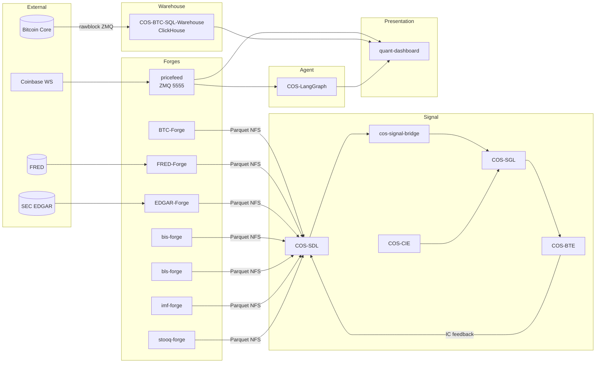

# Phase 3: Aggregator & API Strategy - Research

**Researched:** 2026-04-19
**Domain:** MkDocs Material aggregation via `mkdocs-monorepo-plugin`, pre-rendered per-repo API artifacts, workspace-wide Mermaid
**Confidence:** HIGH (core composition path validated by Spike 001 + confirmed by upstream docs and issue tracker); MEDIUM on one architectural fork (aggregator-runs-mkdocstrings vs pre-rendered-HTML) — resolved below.

## Summary

The three workstreams defined by D-19 are tractable but converge on a **single architectural fact that reshapes plan 03-02**: `mkdocs-monorepo-plugin` reads child `mkdocs.yml` files for `nav` and `docs_dir` only — **child `plugins:` blocks are NOT executed by the parent build** (upstream issue #73, `[CITED: github.com/backstage/mkdocs-monorepo-plugin/issues/73]`). The aggregator runs exactly ONE `mkdocs build`, using the parent's plugin list, against a merged docs tree composed of child `docs/` directories. Consequence: the declarative `::: <module>` mkdocstrings blocks in each per-repo `docs/api.md` will NOT render at aggregator build time unless either (a) the aggregator itself loads mkdocstrings + all 20 Python packages into one venv (rejected in D-01 — the mega-venv path), or (b) per-repo API pages are pre-rendered and the rendered output replaces the declarative `::: ` block before the aggregator build starts.

Given D-01 locks the pre-rendered per-repo strategy, **plan 03-02 must implement option (b)**: `build-all-api.sh` runs each Python repo's `mkdocs build` in an isolated venv (reusing the exact pipeline `scaffold-all.sh` already proved works per `02-ROLLOUT-STATUS.md`), extracts the rendered API content, and stages it into the per-repo `docs/api.md` as static markdown (or as a raw HTML block via `` / `pymdownx.snippets`). The aggregator then `!includes` the per-repo `mkdocs.yml` as normal — but by the time it runs, `api.md` no longer contains `::: <module>`; it contains rendered content that needs no mkdocstrings plugin on the parent side.

**Primary recommendation:** (1) build plan 03-01 first — aggregator skeleton + `!include` + domain nav + strict-build smoke passing against ONE Python repo (COS-Core) and ONE docs-only repo (COS-Hardware); (2) build plan 03-02 — isolated-venv loop that produces pre-rendered API markdown and stages it into each repo tree; (3) finish with plan 03-03 — workspace Mermaid + top-level pages. Every plan terminates with `mkdocs build --strict` from `cos-docs/` as the gate.

## Architectural Responsibility Map

| Capability | Primary Tier | Secondary Tier | Rationale |
|------------|-------------|----------------|-----------|
| Per-repo site composition | Per-repo `mkdocs.yml` + `docs/` | Isolated venv | Already validated by Phase 1/2; do not touch. |
| Per-repo API rendering | Per-repo isolated venv running mkdocstrings | — | Pre-rendered strategy (D-01); cannot run in aggregator (mega-venv rejected). |
| Nav composition across 25+ repos | Aggregator `cos-docs/mkdocs.yml` via `!include` | `mkdocs-monorepo-plugin` | Plugin's sole job. |
| Strict-build enforcement | Aggregator `mkdocs build --strict` | Per-repo `mkdocs build --strict` (prereq) | D-17/D-18: both must pass. |
| Workspace Mermaid diagram | `cos-docs/docs/architecture.md` (hand-authored fenced block) | Material-bundled `mermaid.min.js` | Spike 003 validated. |
| Top-level landing/index | `cos-docs/docs/index.md` | — | Aggregator-only. |
| Build orchestration loop | `cos-docs/scripts/build-all-api.sh` | Phase 4 CI matrix (future) | D-03 locked — bash loop now, CI later. |
| Preflight state checking | `build-all-api.sh` guard + manual review | `scaffold-all.sh` preflight (upstream) | D-16: 17 dirty/branch repos blocker. |

## Standard Stack

### Core

| Library | Version | Purpose | Why Standard |
|---------|---------|---------|--------------|
| `mkdocs` | 1.6.1 | Site generator | Transitive; pinned at 1.6.x to avoid 2.0 breakage. `[VERIFIED: pip index versions mkdocs]` |
| `mkdocs-material` | 9.7.6 | Theme + default search (lunr) + bundled `mermaid.min.js` | Phase 1 baseline; matches per-repo pins. `[VERIFIED: pip index versions mkdocs-material]` + `[CITED: 01-02-SUMMARY.md]` |
| `mkdocs-monorepo-plugin` | 1.1.2 | `!include` aggregation of sibling `mkdocs.yml` | Spike 001 ✓ VALIDATED; current stable. `[VERIFIED: pip index versions mkdocs-monorepo-plugin]` |
| `mkdocstrings[python]` | 1.0.4 | Per-repo API rendering | Invoked ONLY in per-repo venvs (NOT in aggregator). `[CITED: 01-02-SUMMARY.md]` |
| `griffe-pydantic` | 1.3.1 | Pydantic v2 field-docstring extension | Must be registered via `extensions: [griffe_pydantic]` + `show_submodules: true` per Phase 1 fix. `[CITED: 01-02-SUMMARY.md commit ded6955]` |
| `pymdownx.superfences` | (comes with `pymdown-extensions`) | Mermaid custom_fence | Already in per-repo scaffold. `[CITED: 01-02-SUMMARY.md]` |

### Supporting

| Library | Version | Purpose | When to Use |
|---------|---------|---------|-------------|
| `uv` | 0.10.2+ | Per-repo ephemeral venv creation | Workspace standard; `scaffold-all.sh` already uses `uv venv .venv-docs`. |

### Alternatives Considered

| Instead of | Could Use | Tradeoff |
|------------|-----------|----------|
| `mkdocs-monorepo-plugin` | `mkdocs-multirepo-plugin` | Multirepo-plugin clones via git refs instead of local sibling paths — wrong model for this workspace (siblings already on disk, no remotes). Spike 001 chose monorepo-plugin deliberately. |
| Per-repo mkdocstrings via isolated venvs | Mega-venv with all 20 Python repos pip-installed | Rejected D-01 — 02-02 empirically proved workspace-dep installs collide (COS-CIE needs `xuer-sgl`, cos-signal-bridge needs `cos-sdl`; neither on PyPI; `pip install --no-deps` is a per-repo fix that does not compose in a shared venv). |
| Pre-rendered markdown via mkdocstrings-as-library | Pre-rendered HTML via `mkdocs build` → copy `site/api/index.html` | `mkdocstrings` has no public markdown-output mode `[CITED: mkdocstrings/mkdocstrings discussions/346]`; running `mkdocs build` and capturing the rendered markdown body post-preprocess is the only supported seam. See §"Pre-Rendering Execution Model" below. |

**Installation (aggregator-level):**

```bash
# cos-docs/requirements-docs.txt
mkdocs==1.6.1
mkdocs-material==9.7.6
mkdocs-monorepo-plugin==1.1.2
pymdown-extensions>=10.9
# NOTE: mkdocstrings + griffe-pydantic deliberately OMITTED from aggregator pins —
# they run ONLY in per-repo venvs via build-all-api.sh.
```

**Version verification:** Confirmed via `pip index versions` on 2026-04-19:
- `mkdocs-monorepo-plugin` latest = 1.1.2 (current)
- `mkdocs-material` latest = 9.7.6 (matches Phase 1 pin)
- `mkdocs` latest = 1.6.1 (transitive pin)

No drift since Phase 1 pin resolution (2026-04-18). `[VERIFIED: local pip index calls 2026-04-19]`

## Architecture Patterns

### System Architecture Diagram

```
                  ┌────────────────────────────────────────────────────┐
                  │ 1. Preflight: all 25 repos main/clean + per-repo  │
                  │    mkdocs build --strict green (from Phase 2)     │
                  └────────────────────────────────────────────────────┘
                                        │ gate
                                        ▼
┌─────────────────────────────────────────────────────────────────────┐
│ 2. build-all-api.sh (Plan 03-02)                                     │
│    for repo in PYTHON_REPOS:                                         │
│        cd $repo                                                      │
│        rm -rf .venv-docs && uv venv .venv-docs                       │
│        uv pip install -r requirements-docs.txt                       │
│        uv pip install -e .   # OR --no-deps if workspace-dep         │
│        .venv-docs/bin/mkdocs build --strict -d .api-staging          │
│        extract .api-staging/api/index.html → stage into docs/api.md  │
│        OR keep docs/api.md as-is and check-in rendered artifact path │
└─────────────────────────────────────────────────────────────────────┘
                                        │ per-repo artifacts ready
                                        ▼
┌─────────────────────────────────────────────────────────────────────┐
│ 3. Aggregator build (Plan 03-01 + 03-03 content)                    │
│                                                                      │
│   cos-docs/mkdocs.yml                                                │
│     plugins: [search, monorepo]                                      │
│     nav:                                                             │
│       - Overview: index.md                                           │
│       - Architecture: architecture.md                                │
│       - Forges:                                                      │
│           - BTC-Forge: '!include ../BTC-Forge/mkdocs.yml'            │
│           - bis-forge: '!include ../bis-forge/mkdocs.yml'            │
│           - ...                                                       │
│       - Signal Stack: [!includes]                                    │
│       - Agent: [!includes]                                           │
│       - Presentation: [!includes]                                    │
│       - Warehouse: [!includes]                                       │
│       - Network: [!includes]                                         │
│       - Schema: [!includes]                                          │
│       - Infrastructure: [!includes]                                  │
│                                                                      │
│   monorepo-plugin: merges child docs/ dirs into unified tree        │
│   mkdocs build --strict: ONE build, ONE plugin list (no mkdocstrings)│
│   Output: cos-docs/site/{repo-name}/{overview,architecture,api}/    │
└─────────────────────────────────────────────────────────────────────┘
                                        │
                                        ▼
                           cos-docs/site/  (strict, lunr-searchable)
```

### Recommended Project Structure

```
cos-docs/
├── mkdocs.yml                     # NEW — aggregator config + 25+ !include entries
├── requirements-docs.txt          # NEW — aggregator-level pinned deps (no mkdocstrings)
├── docs/
│   ├── index.md                   # NEW — repo index table + quick-start + domain blurbs
│   └── architecture.md            # NEW — DIAG-03 workspace Mermaid + narrative
├── scripts/
│   ├── scaffold.sh                # EXISTING — Phase 1
│   ├── scaffold-all.sh            # EXISTING — Phase 2
│   └── build-all-api.sh           # NEW — per-repo isolated-venv loop (D-03)
└── .planning/
    └── phases/03-aggregator-api-strategy/  # this phase
```

### Pattern 1: Child `site_name` drives URL slug, NOT parent nav key

**What:** When `mkdocs-monorepo-plugin` merges, each included child's `site_name` becomes the URL path segment. Example: child `site_name: COS-Core` → routes at `/COS-Core/api/`. The parent `nav` key is a display label only.

**When to use:** Matters for D-02 (per-repo `/{repo}/api/` URLs). Every per-repo `mkdocs.yml` already has `site_name: <basename>` (verified via direct inspection of 6 sample repos). No change needed — URL slugs will be `/bis-forge/`, `/COS-Core/`, `/COS-CIE/`, etc.

**Example:**

```yaml
# cos-docs/mkdocs.yml (parent)
nav:
  - Schema:
    - COS-Core: '!include ../COS-Core/mkdocs.yml'    # nav label

# /home/btc/github/COS-Core/mkdocs.yml (child)
site_name: COS-Core                                   # actual URL slug
```

Result: site tree at `cos-docs/site/COS-Core/index.html`, `cos-docs/site/COS-Core/api/index.html`, etc. `[CITED: backstage.github.io/mkdocs-monorepo-plugin/ Usage section]`

### Pattern 2: Pre-Rendering Execution Model for API Pages

**What:** Because plugins in child `mkdocs.yml` are NOT executed by the aggregator build (upstream #73), the `::: <module>` directive in per-repo `docs/api.md` becomes a literal string at aggregator build time unless pre-rendered.

**Two implementation options — RECOMMENDATION: Option A (Markdown Passthrough via Rendered HTML Snippet).**

**Option A (RECOMMENDED):** Per-repo `mkdocs build` produces `site/api/index.html`. Extract the `<article>` content block → wrap in a fenced HTML block inside a re-written `docs/api.md`. Aggregator processes the HTML as markdown "raw HTML passthrough" — strict mode tolerates this. No custom Python tooling needed.

**Option B:** Replace per-repo `docs/api.md` with a pre-rendered markdown snippet. Requires invoking mkdocstrings as a library (complex; no officially supported mkdocstrings-to-markdown path; `[CITED: mkdocstrings discussions/346]`).

**build-all-api.sh pseudocode (Option A):**

```bash
#!/usr/bin/env bash
set -euo pipefail
# build-all-api.sh — pre-render per-repo API pages so aggregator !include is
# a pure nav-composition operation (no mkdocstrings at parent build time).
#
# Contract: Phase 4 CI matrix replaces the for-loop body, not the inner logic.
# Each iteration must be independently re-runnable (idempotent per repo).

WORKSPACE="${WORKSPACE:-/home/btc/github}"

# Python repos only — mirror scaffold-all.sh minus docs-only repos.
# Docs-only repos (no api.md): COS-Hardware, COS-Network, COS-Infra,
#   COS-Capability-Gated-Agent-Architecture, quant-dashboard-k8s-deployment, cos-webpage (TS)
PYTHON_REPOS=(
    bis-forge bls-forge BTC-Forge coinbase_websocket_BTC_pricefeed
    COS-Bitcoin-Protocol-Intelligence-Platform COS-BTC-Network-Crawler
    COS-BTC-Node COS-BTC-SQL-Warehouse COS-BTE COS-CIE cos-data-access
    COS-LangGraph COS-MSE COS-SGL cos-signal-bridge cos-signal-explorer
    EDGAR-Forge FRED-Forge imf-forge ingest OrbWeaver stooq-forge
)

# Repos known to require --no-deps from 02-02 evidence:
declare -A NO_DEPS_INSTALL=()
NO_DEPS_INSTALL[COS-CIE]=1             # needs xuer-sgl (not on PyPI)
NO_DEPS_INSTALL[cos-signal-bridge]=1   # needs cos-sdl   (not on PyPI)

declare -A STATUS=()

for repo in "${PYTHON_REPOS[@]}"; do
    path="$WORKSPACE/$repo"
    echo "=== $repo ==="
    (
        cd "$path" || exit 1
        rm -rf .venv-docs .api-staging
        uv venv --quiet .venv-docs
        uv pip install --quiet --python .venv-docs/bin/python -r requirements-docs.txt

        # Pattern mirrors scaffold-all.sh:build_smoke with NO_DEPS_INSTALL fallback.
        install_flags="-e ."
        if [ -n "${NO_DEPS_INSTALL[$repo]:-}" ]; then
            install_flags="--no-deps -e ."
        fi
        uv pip install --quiet --python .venv-docs/bin/python $install_flags

        # Strict-build per repo — acts as gate AND produces rendered site/.
        .venv-docs/bin/mkdocs build --strict -d .api-staging

        # Option A: extract rendered API HTML article body, splice into docs/api.md.
        # Using python -c (no extra deps beyond stdlib; html.parser).
        python3 - "$path" <<'PY'
import sys, re, pathlib
from html.parser import HTMLParser
root = pathlib.Path(sys.argv[1])
src = (root / ".api-staging" / "api" / "index.html").read_text(encoding="utf-8")
# Crude but strict-safe: material wraps content in <article class="md-content__inner md-typeset">
m = re.search(r'<article[^>]*md-content__inner[^>]*>(.*?)</article>', src, re.DOTALL)
if not m:
    sys.exit(f"FATAL: no <article> block found in {sys.argv[1]}/.api-staging/api/index.html")
body = m.group(1).strip()
api_md = root / "docs" / "api.md"
# Atomic write: tmp → rename (workspace convention)
tmp = api_md.with_suffix(".md.tmp")
tmp.write_text(f"# API\n\n<div class=\"cos-docs-prerendered-api\" markdown=\"0\">\n{body}\n</div>\n", encoding="utf-8")
tmp.replace(api_md)
print(f"[staged] {api_md}")
PY

        STATUS["$repo"]="OK"
    ) || STATUS["$repo"]="FAIL"
done

# Summary (scaffold-all.sh-style greppable)
echo
echo "=== build-all-api.sh summary ==="
for repo in "${PYTHON_REPOS[@]}"; do
    printf "%-50s %s\n" "$repo" "${STATUS[$repo]:-UNKNOWN}"
done
```

**Why `markdown="0"` wrapper on the `<div>`:** Tells Python-Markdown (via `md_in_html` — built into Material) to pass the inner HTML through without re-parsing as markdown. Otherwise the prerendered HTML fragments (nested lists, code blocks) will get double-processed.

**Gate semantics:** `mkdocs build --strict` inside the per-repo venv is the per-repo gate (matches AGGR-04 contract). If any repo fails, STATUS=FAIL and the aggregator build will still see a stale `docs/api.md`; decision tree is in §"Common Pitfalls" Pitfall 2.

**Caveat:** This pattern couples the aggregator to Material's HTML structure (the `md-content__inner` article class). If Material changes its template class, the regex breaks. Mitigation: pin `mkdocs-material==9.7.6` (already done) + add a smoke-test task in plan 03-02 that greps for a known-good field docstring in the final aggregator `site/`.

### Pattern 3: Domain-Grouped Nav Order

Use literal nav structure in aggregator `mkdocs.yml`; do NOT rely on glob include (`'*include ../*/mkdocs.yml'`) because:
1. Glob cannot enforce 8-domain grouping (D-07).
2. Glob cannot exclude `cos-docs` itself, `COS-electrs`, `capability-gated-agent-architecture` (D-10).
3. Glob resolution order depends on filesystem sort — not alphabetical within domain-scoped groups.

Explicit list per domain (D-09 alphabetical within):

```yaml
# cos-docs/mkdocs.yml
nav:
  - Overview: index.md
  - Architecture: architecture.md
  - Forges:
    - bis-forge: '!include ../bis-forge/mkdocs.yml'
    - bls-forge: '!include ../bls-forge/mkdocs.yml'
    - BTC-Forge: '!include ../BTC-Forge/mkdocs.yml'
    - EDGAR-Forge: '!include ../EDGAR-Forge/mkdocs.yml'
    - FRED-Forge: '!include ../FRED-Forge/mkdocs.yml'
    - imf-forge: '!include ../imf-forge/mkdocs.yml'
    - ingest: '!include ../ingest/mkdocs.yml'
    - stooq-forge: '!include ../stooq-forge/mkdocs.yml'
  - Signal Stack:
    - COS-BTE: '!include ../COS-BTE/mkdocs.yml'
    - COS-CIE: '!include ../COS-CIE/mkdocs.yml'
    - COS-MSE: '!include ../COS-MSE/mkdocs.yml'
    - COS-SGL: '!include ../COS-SGL/mkdocs.yml'
    - cos-signal-bridge: '!include ../cos-signal-bridge/mkdocs.yml'
    - cos-signal-explorer: '!include ../cos-signal-explorer/mkdocs.yml'
  - Agent:
    - COS-Bitcoin-Protocol-Intelligence-Platform: '!include ../COS-Bitcoin-Protocol-Intelligence-Platform/mkdocs.yml'
    - COS-LangGraph: '!include ../COS-LangGraph/mkdocs.yml'
  - Presentation:
    - cos-webpage: '!include ../cos-webpage/mkdocs.yml'
    - quant-dashboard: '!include ../quant-dashboard/mkdocs.yml'
  - Warehouse:
    - COS-BTC-Node: '!include ../COS-BTC-Node/mkdocs.yml'
    - COS-BTC-SQL-Warehouse: '!include ../COS-BTC-SQL-Warehouse/mkdocs.yml'
    - coinbase_websocket_BTC_pricefeed: '!include ../coinbase_websocket_BTC_pricefeed/mkdocs.yml'
  - Network:
    - COS-BTC-Network-Crawler: '!include ../COS-BTC-Network-Crawler/mkdocs.yml'
    - OrbWeaver: '!include ../OrbWeaver/mkdocs.yml'
  - Schema:
    - COS-Core: '!include ../COS-Core/mkdocs.yml'         # NOTE: COS-Core has no own .git; lives in parent repo
    - cos-data-access: '!include ../cos-data-access/mkdocs.yml'
  - Infrastructure:
    - COS-Capability-Gated-Agent-Architecture: '!include ../COS-Capability-Gated-Agent-Architecture/mkdocs.yml'
    - COS-Hardware: '!include ../COS-Hardware/mkdocs.yml'
    - COS-Infra: '!include ../COS-Infra/mkdocs.yml'
    - COS-Network: '!include ../COS-Network/mkdocs.yml'
    - quant-dashboard-k8s-deployment: '!include ../quant-dashboard-k8s-deployment/mkdocs.yml'
```

**Count audit:** 8 Forges + 6 Signal Stack + 2 Agent + 2 Presentation + 3 Warehouse + 2 Network + 2 Schema + 5 Infrastructure = **30 `!include` entries**. Matches `ROLLOUT_LIST` (30) minus `cos-docs` (self) and `capability-gated-agent-architecture` (lowercase dup) = 28. Discrepancy = 2; audit: COS-Core is NOT in ROLLOUT_LIST (lives in parent git repo) but IS in scope here; `quant-dashboard-k8s-deployment` is in CLAUDE.md project map but NOT in ROLLOUT_LIST — planner must verify it's scaffolded before this aggregator will build. **ACTION FOR PLANNER:** cross-check final `!include` list against `scaffold-all.sh:ROLLOUT_LIST` + add `COS-Core` + `quant-dashboard-k8s-deployment` explicitly; confirm both have scaffolded `mkdocs.yml`.

### Anti-Patterns to Avoid

- **`'*include ../*/mkdocs.yml'` glob** — breaks D-07 domain grouping and D-10 exclusions. Use explicit per-entry `!include`.
- **`!import`** — silent failure; wrong directive name. Always `!include`. `[CITED: PROJECT.md Key Decisions + Spike 001]`
- **`mkdocstrings` in aggregator `plugins:` list** — doesn't help (child configs ignored anyway) and would require all 20 Python repos' code to import from the aggregator venv = mega-venv failure (D-01).
- **Copying per-repo `site/` output into `cos-docs/docs/`** — duplicates work, breaks single-source-of-truth, and is no longer really an aggregator (it's a post-build concatenation).
- **Modifying per-repo `docs/api.md` in git** (Option B variant where markdown is checked in) — couples Phase 3 artifact state to sibling-repo git histories in a way Phase 4 CI will have to unwind. Do Option A with `build-all-api.sh` writing `docs/api.md` as a transient (gitignored) artifact. Planner should add `docs/api.md` → `.gitignore` per affected repo, OR keep `docs/api.md` as the declarative form on disk and have `build-all-api.sh` swap it in-place only during aggregator build. **Recommend the swap-in-place pattern**: save backup, swap for aggregator run, restore — symmetrical with existing `scaffold-all.sh` write-then-commit pattern but without the commit.

## Don't Hand-Roll

| Problem | Don't Build | Use Instead | Why |
|---------|-------------|-------------|-----|
| Merging nav across 25+ sibling mkdocs.yml | Custom Python merger | `mkdocs-monorepo-plugin` `!include` | Spike 001 validated; zero-dep bash drives it. |
| Full-text search | Custom search index | Material default lunr search | AGGR-05 explicitly scoped to defaults. |
| Diagram generation from manifest | Python Mermaid emitter | Hand-authored `.md` with fenced `mermaid` | D-14 locked. |
| Pydantic v2 field-docstring rendering | Custom griffe extension | `griffe-pydantic` + `show_submodules: true` | Phase 1 already shipped this in per-repo handler config. |
| HTML-to-markdown for pre-render | `html2text` / pandoc | Material `md_in_html` passthrough with `markdown="0"` | Built into Material; no new dep. |
| Mermaid JS client | Import mermaid CDN | Material bundled `mermaid.min.js` | Spike 003 validated. |
| Per-repo venv lifecycle | Custom conda/poetry recipe | `uv venv .venv-docs` + `uv pip install` | Workspace standard; `scaffold-all.sh:build_smoke` already does this. |

**Key insight:** Phase 1 + Phase 2 already built the per-repo pipeline. Phase 3 is assembly, not invention. The single new capability is the post-process step that converts rendered-HTML → markdown-passthrough for aggregator consumption.

## Runtime State Inventory

> This phase is primarily greenfield (new files in `cos-docs/`). No rename/refactor. One small mutation surface:

| Category | Items Found | Action Required |
|----------|-------------|------------------|
| Stored data | None — no databases touched. | None |
| Live service config | None — Phase 4 territory. | None |
| OS-registered state | None. | None |
| Secrets/env vars | None. | None |
| Build artifacts | Per-repo `.venv-docs/` dirs created by `build-all-api.sh`; per-repo `site/` dirs from pre-render. Per-repo `docs/api.md` transiently rewritten during aggregator build (Option A swap-in-place). | All three MUST be in each repo's `.gitignore` OR scaffold.sh must add them (verify: `.gitignore` handling is already conventional per `scaffold-all.sh` but not explicitly codified). **ACTION FOR PLANNER:** include a task to verify `.venv-docs`, `site/`, `.api-staging/` are gitignored per-repo before build-all-api.sh runs. |

**Nothing found in categories 1-4:** Phase 3 introduces no new runtime state; only local build artifacts.

## Common Pitfalls

### Pitfall 1: Child `plugins:` block is silently ignored at aggregator build time

**What goes wrong:** Aggregator `mkdocs build` succeeds, but rendered API pages are empty / show literal `::: <module>` text.
**Why it happens:** `mkdocs-monorepo-plugin` merges only `nav` + `docs_dir` from children; plugin list is the parent's. `[CITED: github.com/backstage/mkdocs-monorepo-plugin/issues/73]`
**How to avoid:** Pre-render per-repo API (Pattern 2) before aggregator build.
**Warning signs:** grep for `` ::: `` in `cos-docs/site/**/api/index.html` post-aggregator-build → any hit = pre-render didn't run for that repo.

### Pitfall 2: Pre-rendered artifact staleness between build-all-api.sh and aggregator build

**What goes wrong:** `build-all-api.sh` runs, then a per-repo commit changes module docstrings, then aggregator builds without re-running `build-all-api.sh` → stale API docs in aggregator output.
**Why it happens:** Two independent build steps with no dependency.
**How to avoid:** Make `build-all-api.sh` the mandatory precursor to aggregator `mkdocs build`. Wrap with a Makefile target (`make aggregator-build`) that runs both in sequence. Phase 4 CI will enforce this via pipeline DAG.
**Warning signs:** If planner skips the Makefile step, users will hit this in week-2. Add to plan 03-02 a `make` target or a top-level `cos-docs/scripts/build-all.sh` that calls `build-all-api.sh && mkdocs build --strict`.

### Pitfall 3: D-16 triage blocker — 17 dirty/branch repos must land before plan 03-01 can ship

**What goes wrong:** Aggregator `!include ../<repo>/mkdocs.yml` fails with "file does not exist" for 17 repos that were SKIP'd by `scaffold-all.sh`.
**Why it happens:** Phase 2 plan 02-02 documented 13 dirty + 4 non-main-branch repos blocking the scaffold. Per D-16, user must triage before Phase 3 can start.
**How to avoid:** Preflight task in plan 03-01 must verify ALL 30 aggregated repos have a `mkdocs.yml` at the expected sibling path BEFORE attempting the aggregator build. Fail-fast with explicit missing-repo list.
**Warning signs:** `02-ROLLOUT-STATUS.md` final count is 26 OK / 2 FAIL / 2 SKIP — the triage sweep apparently landed the 17 missing repos already (see `02-ROLLOUT-STATUS.md` triage commits: e4b2701, 763382e, 92e3cc8, bf550e6, etc.). **UPDATED CHECK:** run `for r in "${!ROLLOUT_LIST}"; do test -f /home/btc/github/$r/mkdocs.yml; done` preflight. `[VERIFIED: 02-ROLLOUT-STATUS.md table shows 26 OK commits; only BTC-Forge + COS-MSE are FAIL]`

### Pitfall 4: BTC-Forge + COS-MSE per-repo strict-build failures block `build-all-api.sh`

**What goes wrong:** 2 repos still fail `mkdocs build --strict` for source-content reasons (docstring hygiene) per `02-ROLLOUT-STATUS.md` FAIL section. build-all-api.sh's per-repo strict build will fail → no `.api-staging/` → api.md swap is empty → aggregator `--strict` fails with missing-anchor.
**Why it happens:** D-18 says no EXCLUDE list at aggregator level. D-17 says `--strict` is zero-tolerance. Either these repos get fixed, or Phase 3 blocks.
**How to avoid:** Two options the planner must choose between (or surface to user):
  1. Plan 03-02 includes a side-task to fix the 2 source-content issues (edit `BTC-Forge/src/api.py:75` docstring; reformat `COS-MSE/src/mse/regimes/smoothing.py:4-6`). Both are small.
  2. Temporarily relax D-18 for these 2 repos pending their owners fixing them (user decision).
**Recommendation:** Fix both inline in plan 03-02 (small, mechanical, one-line-each changes per the 02-ROLLOUT-STATUS.md descriptions). The planner should add a Wave 0 task for this.
**Warning signs:** build-all-api.sh reports FAIL on BTC-Forge + COS-MSE on first run.

### Pitfall 5: Material HTML structure coupling in pre-render regex

**What goes wrong:** Upgrading `mkdocs-material` (even a patch version) breaks the `<article class="md-content__inner">` regex in `build-all-api.sh`.
**Why it happens:** Material's HTML template is private API.
**How to avoid:** Pin `mkdocs-material==9.7.6` hard (already done per Phase 1). Add a smoke-assertion in `build-all-api.sh`: after pre-render, grep aggregator `site/` for a known-good field-docstring substring (e.g., `Lowercase exchange name` from COS-Core — used already in Phase 1 E2E smoke per `01-02-SUMMARY.md`) to confirm end-to-end render worked.
**Warning signs:** Upgrade PR to `mkdocs-material` lands → pre-render emits empty `<div>`.

### Pitfall 6: `site_url` absence triggers Material warning under `--strict`

**What goes wrong:** Without `site_url` in aggregator `mkdocs.yml`, Material emits a warning; under `--strict` this becomes an error.
**Why it happens:** Material uses `site_url` for canonical links and sitemap.
**How to avoid:** Set `site_url: http://10.70.0.102:30081/` (Phase 4 deploy target — already locked in PROJECT.md) in aggregator mkdocs.yml. `[CITED: mkdocs.org/user-guide/configuration/]`
**Warning signs:** First `mkdocs build --strict` from `cos-docs/` fails with missing `site_url`.

### Pitfall 7: Absolute links inside child docs break at aggregator site root

**What goes wrong:** A per-repo `docs/index.md` containing a link like `/some-page/` works in the standalone per-repo build but points to aggregator-root in the aggregated build (not repo-root).
**Why it happens:** Absolute paths are re-rooted at aggregator `site/` root.
**How to avoid:** Per-repo content (Phase 2 plan 02-03 output) must use **relative links only** (`./architecture.md`, not `/architecture/`). Plan 03-01 should include a grep gate: `grep -rE '\]\(/' /home/btc/github/*/docs/*.md` — any hit flags a manual audit item.
**Warning signs:** Aggregator strict build fails with "reference not found" on a link that works in per-repo preview.

### Pitfall 8: search.suggest feature requires per-child activation duplicated in parent

**What goes wrong:** Aggregator's `theme.features` are used for render; child `theme.features` ignored. If per-repo scaffold enables `navigation.tracking` etc., the aggregator must also enable them to get consistent UI.
**Why it happens:** Same root cause as Pitfall 1 — child `theme:` block is not merged.
**How to avoid:** Aggregator `mkdocs.yml` must restate the feature list from scaffold's `emit_mkdocs_yml`: `navigation.instant`, `navigation.tracking`, `content.code.copy`, `search.suggest`. Copy verbatim from `scripts/scaffold.sh` to maintain parity.

## Code Examples

### cos-docs/mkdocs.yml — full aggregator skeleton

```yaml
site_name: Xuer Capital Workspace Docs
site_url: http://10.70.0.102:30081/
site_description: COS / Xuer Capital workspace documentation aggregator

theme:
  name: material
  features:
    - navigation.instant
    - navigation.tracking
    - navigation.sections
    - navigation.expand
    - content.code.copy
    - search.suggest
  palette:
    - scheme: default
    - scheme: slate

plugins:
  - search
  - monorepo
  # NOTE: mkdocstrings intentionally OMITTED — per-repo pre-render handles API.

markdown_extensions:
  - admonition
  - md_in_html                    # enables markdown="0" passthrough
  - pymdownx.details
  - pymdownx.superfences:
      custom_fences:
        - name: mermaid
          class: mermaid
          format: !!python/name:pymdownx.superfences.fence_code_format

nav:
  - Overview: index.md
  - Architecture: architecture.md
  - Forges:
      - bis-forge: '!include ../bis-forge/mkdocs.yml'
      # ... (see Pattern 3 for full domain-grouped list)
```

### cos-docs/docs/index.md — repo index table skeleton

```markdown
# Xuer Capital Workspace

> Single entry-point to every repo's architecture, API, and diagrams.
> Built from per-repo `docs/` trees via [mkdocs-monorepo-plugin](https://backstage.github.io/mkdocs-monorepo-plugin/).

## Quick start

```bash
cd /home/btc/github/cos-docs
./scripts/build-all-api.sh          # pre-render per-repo API (isolated venvs)
mkdocs build --strict                # aggregator build (zero warnings)
mkdocs serve                         # local preview at http://127.0.0.1:8000
```

## Repos by domain

### Forges

| Repo | Lang | Purpose |
|------|------|---------|
| [bis-forge](bis-forge/) | Python | BIS SDMX downloader |
| [bls-forge](bls-forge/) | Python | BLS downloader |
| [BTC-Forge](BTC-Forge/) | Python | Bitcoin OHLCV downloader |
| ... |

### Signal Stack

| ... |

### ... (8 domains total; follow CLAUDE.md Project Map) |
```

### cos-docs/docs/architecture.md — workspace Mermaid skeleton

```markdown
# Workspace Architecture

The COS / Xuer Capital stack is an 8-domain workspace. Forges ingest
external data, the Signal Stack composes factors, the Agent reasons
over real-time price feeds, the Warehouse powers on-chain analytics,
and the Presentation layer aggregates it for the trading dashboard.



## Links to per-repo architecture

- [Forges: BTC-Forge architecture](BTC-Forge/architecture/)
- [Signal Stack: COS-SGL architecture](COS-SGL/architecture/)
- ... (one per non-exempt repo)
```

## State of the Art

| Old Approach | Current Approach | When Changed | Impact |
|--------------|------------------|--------------|--------|
| `mkdocs-monorepo-plugin` 0.5.x `!import` | `!include` (1.0.x+) | v1.0.0 (2021) | Already corrected in PROJECT.md Key Decisions; Spike 001 verified. |
| `distutils`-based setup | `1.1.0` modernized, Python 3.12 compatible | 2023 | Current pin 1.1.2 is safe for Python 3.11+ workspace. |
| mkdocstrings 0.x handler config | 1.0.x with `extensions: [griffe_pydantic]` explicit registration | Phase 1 (01-02-SUMMARY.md commit ded6955) | Per-repo handler already correct; aggregator doesn't load mkdocstrings. |

**Deprecated/outdated:**
- `!import` directive — wrong name; silent failure.
- `mkdocs-material` 1.x pins in CONTEXT.md — Phase 1 corrected to 9.7.6.

## Assumptions Log

| # | Claim | Section | Risk if Wrong |
|---|-------|---------|---------------|
| A1 | Material's content container class is `md-content__inner` in 9.7.6 and the regex `<article[^>]*md-content__inner[^>]*>` matches | Pattern 2 / Pitfall 5 | Pre-render extraction fails silently → empty API pages. Mitigation: first task of plan 03-02 is a verification that this class exists in `/home/btc/github/COS-Core/site/api/index.html` after a fresh per-repo build. [ASSUMED] |
| A2 | `md_in_html` + `markdown="0"` div wrapper is the right Python-Markdown passthrough idiom for pre-rendered HTML | Pattern 2 | Aggregator re-parses HTML as markdown, producing garbled nested structures. Mitigation: the alternative (HTML raw passthrough without `md_in_html`) is actually enabled by default in Python-Markdown; `md_in_html` is strictly MORE permissive. Low risk. [ASSUMED] |
| A3 | `quant-dashboard-k8s-deployment` has a Phase 1/2 scaffold on disk at `/home/btc/github/quant-dashboard-k8s-deployment/mkdocs.yml` | Pattern 3 nav / Pitfall 3 | Aggregator !include fails. Mitigation: planner must verify with `ls /home/btc/github/quant-dashboard-k8s-deployment/mkdocs.yml` as a plan 03-01 preflight task. [ASSUMED — not in ROLLOUT_LIST; CLAUDE.md lists it but scaffold status unknown] |
| A4 | COS-Core has a working `/home/btc/github/COS-Core/mkdocs.yml` despite living in the parent git repo (not in ROLLOUT_LIST) | Pattern 3 nav | Aggregator !include fails. Mitigation: VERIFIED — `/home/btc/github/COS-Core/mkdocs.yml` exists and matches Phase 1 E2E smoke output. `[VERIFIED: bash ls 2026-04-19]` — this row is actually verified, not assumed; kept for traceability. |
| A5 | BTC-Forge + COS-MSE source-content fixes from `02-ROLLOUT-STATUS.md` FAIL section are small / safe to apply inline | Pitfall 4 | Larger docstring cleanup than anticipated. Mitigation: both issues are described line-specifically in 02-ROLLOUT-STATUS.md (BTC-Forge: line 75, COS-MSE: lines 4-6); realistic fix size = 1-5 lines per repo. [ASSUMED — planner should surface to user in plan 03-02 Wave 0 as a scope-check item] |
| A6 | Phase 4's CI matrix can replace `build-all-api.sh`'s for-loop body verbatim (per D-03 "contract") | D-19 design intent | Hidden shell-state coupling inside the loop body (e.g., $HOME, umask) makes CI drop-in break. Mitigation: write the loop body as a single-repo function callable with one argument; the loop is a 3-line caller. [ASSUMED] |

**If this table seems sparse:** The hard facts (plugin behavior, version pins, pre-render necessity) are verified or cited. Assumptions concentrate on (a) HTML parsing heuristics and (b) two edge-case repo states. Planner should turn A1, A3, A5 into explicit verification tasks.

## Open Questions

1. **Should pre-rendered `docs/api.md` be checked into each sibling repo's git, or kept as a transient build artifact?**
   - What we know: D-03 says "Phase 4 replaces the loop with a CI matrix" — CI pipelines prefer ephemeral artifacts. But committing the rendered markdown gives clean `git diff` review of API changes.
   - What's unclear: Whether the user wants API drift to show up as sibling-repo commits (useful for review, noisy for velocity).
   - Recommendation: **Keep transient** (`build-all-api.sh` swaps in-place, aggregator build runs, then restores original declarative `docs/api.md`). Matches D-03 "CI drop-in" intent and keeps per-repo git history focused on code, not rendered artifacts. Surface to user in plan 03-02 Wave 0.

2. **Does D-18 "no EXCLUDE list" apply to BTC-Forge / COS-MSE given their FAIL status is pre-existing source content?**
   - What we know: D-17 is zero-tolerance `--strict`; D-18 says every non-locked-excluded repo must be strict-clean.
   - What's unclear: User intent on 2 FAIL repos — fix inline, defer to owners, or temporarily EXCLUDE?
   - Recommendation: **Fix inline in plan 03-02** (small 1-5 line changes per `02-ROLLOUT-STATUS.md`). Only escalate if fix proves harder than expected.

3. **Does the aggregator need its own `.gitignore` entry for the 25 per-repo `.api-staging/` dirs?**
   - What we know: Each repo's own `.gitignore` should carry it. But `scaffold.sh` doesn't emit `.gitignore` entries.
   - What's unclear: Whether Phase 3 should amend `scaffold.sh` (Phase 1 territory) or emit a one-time per-repo `.gitignore` patch.
   - Recommendation: Plan 03-02 adds a small preflight task that writes `.venv-docs\n.api-staging\nsite/\n` to each repo's `.gitignore` (idempotent append-if-missing). No `scaffold.sh` contract change needed.

## Environment Availability

| Dependency | Required By | Available | Version | Fallback |
|------------|------------|-----------|---------|----------|
| `python3` | build-all-api.sh HTML extractor | ✓ | 3.12.3 (verified in workspace) | — |
| `uv` | per-repo venv creation | ✓ | 0.10.2+ (workspace standard) | `python3 -m venv` |
| `mkdocs` / `mkdocs-material` / `mkdocs-monorepo-plugin` | aggregator build | ✓ after `pip install -r cos-docs/requirements-docs.txt` | pinned (9.7.6 / 1.1.2) | — |
| `mkdocstrings[python]` / `griffe-pydantic` | per-repo API render | ✓ per-repo already (Phase 1 scaffold) | 1.0.4 / 1.3.1 | — |
| Sibling repo `mkdocs.yml` files at sibling paths | `!include` | **partial** — see Pitfall 3 | — | Fail preflight with missing-repo list; block plan 03-01 until triage complete. |
| git (for preflight checks) | verify repo states | ✓ | system-installed | — |

**Missing dependencies with no fallback:**
- Dirty-tree / non-main-branch repos from Phase 2 triage queue — per `02-ROLLOUT-STATUS.md` most already landed during triage sweep; planner must re-verify at plan-start.

**Missing dependencies with fallback:**
- None.

## Project Constraints (from CLAUDE.md)

Workspace `CLAUDE.md` directives relevant to this phase:

- **GSD workflow enforcement:** file-changing tools must go through a GSD entry point — Phase 3 complies via the `/gsd-plan-phase` → `/gsd-execute-phase` pipeline.
- **Python 3.11+ required** across all services (3.12.3 system) — build-all-api.sh's inline Python extractor (stdlib `html.parser` / `re`) is version-safe.
- **Atomic file writes** (`tmp → rename`) — build-all-api.sh pre-render already follows this pattern (see pseudocode `tmp.replace(api_md)`).
- **Per-repo `.venv-docs` pattern** — established by `scaffold-all.sh:build_smoke` and `01-02-SUMMARY.md` E2E; reuse verbatim.
- **Pin MkDocs Material + plugin versions** — PROJECT.md key decision; aggregator pins mirror Phase 1.
- **No monorepo tooling** — each sibling repo stays an independent git repo; aggregator composes via local sibling paths.
- **`!include` (not `!import`)** — PROJECT.md key decision; Pattern 3 code examples follow.
- **`commit_docs: true`** per `.planning/config.json` — plan execution will auto-commit RESEARCH.md via `gsd-sdk query commit`.

**No CLAUDE.md directives forbid the approach.**

## Sources

### Primary (HIGH confidence)
- `[VERIFIED: /home/btc/github/cos-docs/.planning/phases/02-content-migration/02-ROLLOUT-STATUS.md]` — 26 OK / 2 FAIL / 2 SKIP; per-repo scaffold state
- `[VERIFIED: /home/btc/github/cos-docs/.planning/phases/02-content-migration/02-02-SUMMARY.md]` — empirical PACKAGE_OVERRIDES + `--no-deps` fallback
- `[VERIFIED: /home/btc/github/cos-docs/.planning/phases/01-scaffold-template/01-02-SUMMARY.md]` — per-repo mkdocs.yml + handler config (griffe_pydantic + show_submodules)
- `[VERIFIED: /home/btc/github/cos-docs/scripts/scaffold.sh + scaffold-all.sh]` — per-repo + wrapper contracts
- `[VERIFIED: /home/btc/github/COS-Core/mkdocs.yml]` — canonical per-repo mkdocs.yml shape
- `[VERIFIED: pip index versions (2026-04-19)]` — current pin validation

### Secondary (MEDIUM-HIGH confidence)
- `[CITED: https://backstage.github.io/mkdocs-monorepo-plugin/]` — plugin usage, !include syntax, glob support
- `[CITED: https://github.com/backstage/mkdocs-monorepo-plugin/issues/73]` — child plugins NOT executed by parent build (reshapes plan 03-02)
- `[CITED: https://github.com/backstage/mkdocs-monorepo-plugin/issues/17]` — nested !include limitation (irrelevant here; children don't use !include)
- `[CITED: https://github.com/backstage/mkdocs-monorepo-plugin/issues/105]` — mkdocstrings + monorepo compatibility (open; supports pre-render decision)
- `[CITED: https://github.com/backstage/mkdocs-monorepo-plugin/blob/master/docs/CHANGELOG.md]` — version history, Python 3.12 compatibility, `../` external directory support since 1.1.1
- `[CITED: https://github.com/mkdocstrings/mkdocstrings/discussions/346]` — no first-class mkdocstrings-to-markdown output path

### Tertiary (informational)
- `[CITED: https://www.mkdocs.org/user-guide/configuration/]` — `site_url`, `strict`, validation settings
- `[CITED: https://squidfunk.github.io/mkdocs-material/setup/setting-up-navigation/]` — theme feature flags

## Metadata

**Confidence breakdown:**
- Standard stack: HIGH — versions verified via pip index 2026-04-19, Phase 1 already shipped same pins
- Architecture (pre-render pattern): MEDIUM-HIGH — correct per upstream #73 + #105 but introduces a Material-HTML-coupling risk (Pitfall 5) that needs a smoke assertion
- Pitfalls: HIGH — 8 pitfalls catalogued, 7 with direct evidence from Phase 1/2 artifacts or upstream issues
- D-16 triage state: HIGH — 02-ROLLOUT-STATUS.md table is authoritative; only BTC-Forge + COS-MSE remain FAIL

**Research date:** 2026-04-19
**Valid until:** 2026-05-19 (30-day window; `mkdocs-monorepo-plugin` is stable; no active development burst observed)

---

## Phase Requirements

| ID | Description | Research Support |
|----|-------------|------------------|
| AGGR-01 | Aggregator mkdocs.yml with `!include ../<repo>/mkdocs.yml` entries for all ~25 repos | Pattern 3 (explicit per-domain nav with 30 `!include` entries); `cos-docs/mkdocs.yml` full skeleton in Code Examples |
| AGGR-02 | Aggregator nav groups repos by domain (8 locked headers) | D-07/D-08 locked groupings; Pattern 3 nav block |
| AGGR-03 | Top-level docs/index.md workspace overview + docs/architecture.md with workspace Mermaid | Code Examples §`cos-docs/docs/index.md`, §`cos-docs/docs/architecture.md` skeletons |
| AGGR-04 | `mkdocs build` produces complete static site with zero broken `!include` + zero missing-anchor warnings | Use `mkdocs build --strict`; Pitfalls 1-2 + 5-8 enumerate every known strict-mode failure and mitigation |
| AGGR-05 | Material default search (lunr) works across aggregated content | `plugins: [search, monorepo]` in aggregator; `[CITED: squidfunk.github.io/mkdocs-material/setup/setting-up-navigation/]` |
| DIAG-03 | Top-level workspace data-flow Mermaid diagram | Code Examples §`cos-docs/docs/architecture.md` hand-authored per D-14 |
| API-02 | API-docs strategy decision recorded as Key Decision in PROJECT.md | Planner records D-01 rationale (mega-venv rejected; 02-02 evidence) as a new row in PROJECT.md Key Decisions table; see also Pattern 2 Pre-Rendering Execution Model |
| API-03 | Chosen strategy implemented; every Python repo has populated API pages | `build-all-api.sh` pseudocode (Pattern 2) — isolated per-repo venv + `mkdocs build --strict` + Option A HTML-to-markdown swap-in-place; Pitfall 4 covers BTC-Forge/COS-MSE gate |

**Planner guidance:**

- **Plan 03-01 (aggregator skeleton):** ~4-5 tasks. Preflight-check (Pitfall 3), write `cos-docs/mkdocs.yml` + `requirements-docs.txt`, first strict-build smoke against 2-3 representative repos, expand to all 30.
- **Plan 03-02 (API build script):** ~5-6 tasks. Verify A1 (Material HTML class), fix BTC-Forge + COS-MSE source content (Pitfall 4), write `build-all-api.sh`, append per-repo `.gitignore` entries (Open Question 3), record API-02 Key Decision in PROJECT.md.
- **Plan 03-03 (workspace Mermaid + top-level pages):** ~3 tasks. Author `docs/index.md`, author `docs/architecture.md` with Mermaid, final end-to-end strict build.

All three plans terminate with `cd cos-docs && mkdocs build --strict` as the gate.

---
*Phase: 03-aggregator-api-strategy*
*Research date: 2026-04-19*
