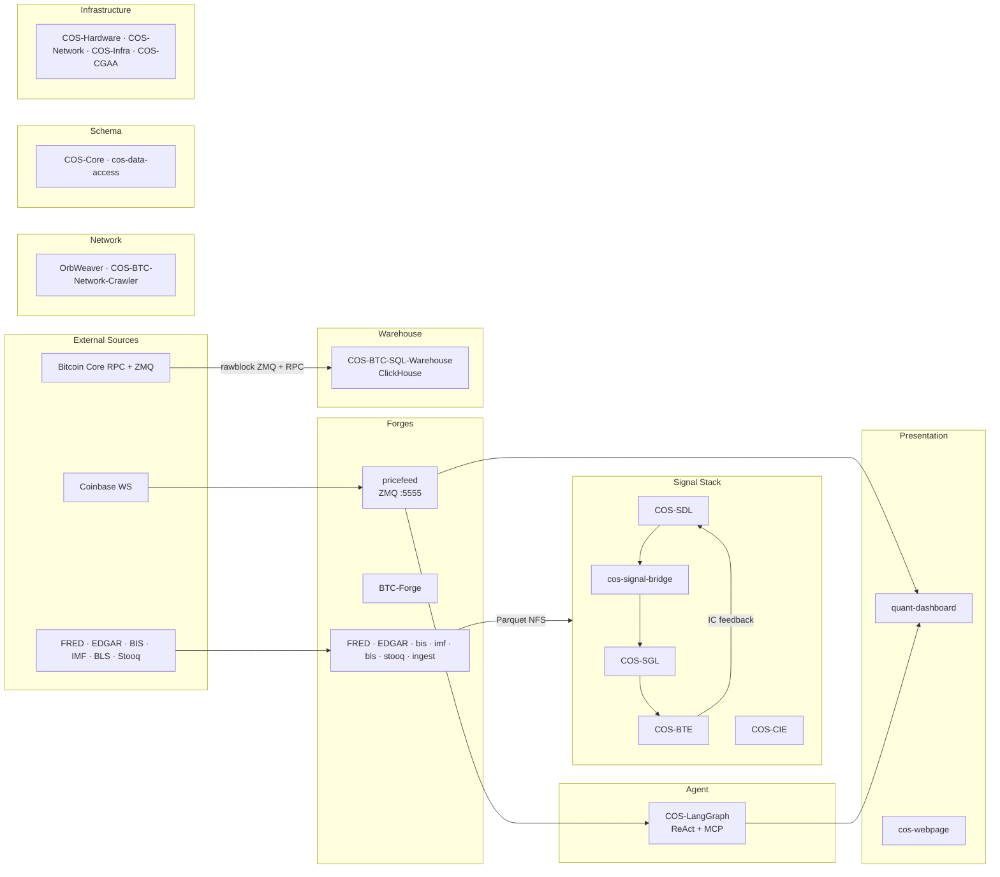

# Workspace Architecture

## Overview

The COS / Xuer Labs stack is an 8-domain quantitative-finance platform
spanning data ingestion, signal composition, backtesting, on-chain analytics,
agent reasoning, and live-trading presentation. Each repo is an independent
git repo under `/home/btc/github/`; the aggregator composes their `docs/` via
[mkdocs-monorepo-plugin](https://backstage.github.io/mkdocs-monorepo-plugin/).

The data plane is anchored on three real-time sources (Coinbase WS for prices,
Bitcoin Core ZMQ for on-chain blocks, and batch Parquet pulls for macro/financial
data) and flows through the Signal Stack (SDL discovers factors, SGL computes
them, CIE composes indicators, BTE backtests them) into the Presentation layer
(Bloomberg-style React dashboard). The Agent layer (LangGraph) reasons over both
real-time prices and on-chain query APIs. Infrastructure and Schema repos
underpin the whole stack with canonical Pydantic models, K8s deployment specs,
and hardware inventory.

See per-repo architecture pages for internal details — this diagram is the
workspace-scale view only.

## Diagram

## Links to per-repo architecture

Each non-exempt repo's own Mermaid lives in `docs/architecture.md`:

- **Forges:** [BTC-Forge](BTC-Forge/architecture/) · [FRED-Forge](FRED-Forge/architecture/) · [EDGAR-Forge](EDGAR-Forge/architecture/) · [bis-forge](bis-forge/architecture/) · [bls-forge](bls-forge/architecture/) · [imf-forge](imf-forge/architecture/) · [ingest](ingest/architecture/) · [stooq-forge](stooq-forge/architecture/)
- **Signal Stack:** [COS-BTE](COS-BTE/architecture/) · [COS-CIE](COS-CIE/architecture/) · [COS-MSE](COS-MSE/architecture/) · [COS-SGL](COS-SGL/architecture/) · [cos-signal-bridge](cos-signal-bridge/architecture/) · [cos-signal-explorer](cos-signal-explorer/architecture/)
- **Agent:** [COS-Bitcoin-Protocol-Intelligence-Platform](COS-Bitcoin-Protocol-Intelligence-Platform/architecture/) · [COS-LangGraph](COS-LangGraph/architecture/)
- **Presentation:** [cos-webpage](cos-webpage/architecture/) · [quant-dashboard](quant-dashboard/architecture/)
- **Warehouse:** [COS-BTC-Node](COS-BTC-Node/architecture/) · [COS-BTC-SQL-Warehouse](COS-BTC-SQL-Warehouse/architecture/) · [coinbase_websocket_BTC_pricefeed](coinbase_websocket_BTC_pricefeed/architecture/)
- **Network:** [COS-BTC-Network-Crawler](COS-BTC-Network-Crawler/architecture/) · [OrbWeaver](OrbWeaver/architecture/)
- **Schema:** [COS-Core](COS-Core/architecture/) · [cos-data-access](cos-data-access/architecture/)
- **Infrastructure:** (docs-only repos; see individual overviews)
